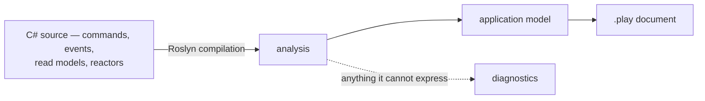

An [event model](/event-modeling/) is the picture of your system: which commands change state, which events they produce, which read models those events build, and which reactors turn one thing into another. Teams draw it on a whiteboard at the start, and then the code moves on without it. Six months later the picture is fiction and nobody trusts it enough to open.

**Screenplay** is a small language for writing that picture down as text — a `.play` file — so it can live in the repository next to the code it describes. Arc can *generate* one from your application's source. The model stops being something you maintain by hand and becomes something you regenerate, the same way the [TypeScript proxies](./understanding-the-proxy-boundary.mdx) are regenerated rather than hand-written.

## Generated from source, not from a running system

The generator reads a Roslyn compilation of your C# — the same thing the compiler sees. It never starts your application, connects to Chronicle, or looks at a deployed instance.

That choice is what makes the output useful:

- **It works from a checkout.** No database, no configuration, no environment. Clone and generate.
- **It is diffable in a pull request.** A commit that adds a command shows up as a few lines added to the `.play`. Reviewers see the model change next to the code change, and "did this alter the event model?" becomes a question the diff answers.
- **It is reproducible.** The same source always produces byte-identical output. Everything is ordered explicitly rather than by whatever order symbols happened to arrive in, so regenerating in CI and failing on a diff is a viable check.

A runtime-derived model would answer a different question — what one deployed instance looks like right now — and would vary with configuration and environment. There is one model, and its source of truth is your source code.



## Running it

The generator is used through the Cratis CLI, which ships separately from Arc:

```shell
cratis screenplay generate ./MyApp/MyApp.csproj --file MyApp.play
```

Point it at a project or a solution. Anything the generator could not express is reported on the way out, and a run that reports an error exits non-zero — so a broken build never quietly produces a document that looks fine.

Because output is reproducible, a CI step can regenerate and fail when the committed `.play` no longer matches the source.

## Nothing is dropped silently

The gap between "what C# can say" and "what Screenplay can say" is real, and the worst thing a generator can do is paper over it. Every construct that cannot be expressed is reported as a located diagnostic — a stable code, a message you can act on, and where it came from — rather than quietly disappearing.

```text
Warning SP0019: The query 'Raw' returns 'IActionResult', which says how the result is
transported rather than what it is, so the query was left out (Library.Messaging.Feed)
```

Diagnostics come in three severities. **Information** means something is worth knowing but the document is complete. **Warning** means something was left out. **Error** means the document should not be trusted at all — the most common cause being source that did not compile.

## The generator checks its own output

Every diagnostic above names something *your application* declared that the language cannot hold. There is one that names a defect in the generator instead.

After the document is written, the generator hands it straight back to the Screenplay compiler. If the compiler rejects it, `SP0034` is reported as an error — because a `.play` that does not compile is output nobody can use, and there is no way of writing an application that avoids it. This is not a mode you turn on: it runs on every generation, since the only way a rejected document is ever found is by reading each one back.

```text
Error SP0034: The generated document did not compile - 1 error(s), the first being
'Invalid description 'description RequestDescription' - expected 'description "<text>"''
on line 6. That is the generator being wrong rather than anything the source declared,
and the document is returned as it stands so the line can be read (Library)
```

The document is still written out, so you can open it at the reported line and see what happened. If you hit this, it is a bug worth [reporting](https://github.com/Cratis/Arc/issues) — include the line, and the C# declaration it came from.

Source that did not compile (`SP0024`) suppresses `SP0034`. A model recovered from symbols the compiler never accepted describes an application that does not exist, so a poor document made from it is a consequence of the broken build rather than a second, separate defect. Fix the build and generate again.

## Screens

A [vertical slice](./vertical-slices.md) puts the React component that realizes a slice's screen in the same folder as its C#. Roslyn syntax trees carry real file paths, so the generator knows where each slice's source lives and declares a `screen` for every `.tsx` component sitting next to it, named after the file:

```text
slice StateView Listing
  query AllAuthors => Author[]
  query AuthorById(id : String) => Author

  screen AuthorList
    file Authors/Listing/AuthorList.tsx
    data Author[] via query AllAuthors
    data Author via query AuthorById by id
```

Two things about a screen are recovered, and both come from something that can be checked.

**The `file` reference** says which file realizes the screen. It is what a reader opens, and no directive replaces it, so it stays on the screen even when directives sit beside it.

**The `data` directives** say which of the slice's queries the screen reads through. Arc generates a TypeScript proxy per query and a component imports that proxy by name, so the component's `import` statements name candidates — and a candidate is kept only when it matches a query the slice really declares. Nothing about the binding comes from the component beyond that name: the read model, whether there is one or many of it, and the parameter it is keyed by all come from the C# query. An import naming anything else — a package, a command, a sibling component, a type-only import — leaves nothing behind.

Everything else in the declarative form — `title`, `section`, `table` and `summary` with their columns and fields, `action`, `navigate to`, `layout` — is **never inferred**. That is structure expressed in JSX and component properties, and a guessed column is worse than an absent one: it puts a confident falsehood into a document whose entire value is that it describes the real application. Every screen reports `SP0028` to say so. Write those directives by hand if you want them, and expect a regeneration to leave them out.

Two more rules keep the result honest:

- **Components only, no descending.** A file carrying a second extension — `AddAuthor.stories.tsx`, `AddAuthor.spec.tsx` — is a companion of a component, not a screen. A folder *inside* a slice folder is a slice of its own under the same convention, so its files belong to it.
- **Anything uncertain is reported.** The relationship between a file and a slice comes entirely from where the file sits, so `SP0025` is reported whenever sitting there says less than usual: a slice whose source is spread over several folders, one folder holding the source of several slices, or two files claiming a single screen name.

## What is not expressed

A `.play` is a description of an application, not a second copy of it. **It does not round-trip back to code**, and reading one will not tell you everything the code does. The losses run in both directions.

### Screenplay constructs the generator cannot infer

These are part of the language, but nothing in C# says them, so a generated document never contains them. Add them by hand if you want them, and expect a regeneration to leave them out:

| Construct | Why it cannot be inferred |
|---|---|
| `capture` | Describes ingesting an external system. Nothing in an Arc application declares one. |
| `persona` | Who uses the system is a product decision, not a code artifact. |
| `seed` | Sample data is a modeling concern, not something the source states. |
| The widgets of a `screen` — `title`, `section`, `table`, `summary`, `action`, `navigate to`, `layout` | What a screen *shows and does* is JSX. Its `file` reference and its `data` bindings are generated; the rest would be a guess — see [Screens](#screens). |
| `@sensitive` | Only `[PII]` has a counterpart. Other sensitivity levels are not declared in Arc. |

### Detail Screenplay cannot represent

These exist in your application and have no counterpart in the language. Each is reported as a diagnostic when encountered, so the document tells you it is silent about them:

| In Arc or Chronicle | Why it is not in the document |
|---|---|
| Event generations, `[Tombstone]`, `[CompensationFor]` | Screenplay describes the current shape of an event. It has no notion of versioning, of a deletion marker, or of one event compensating another. |
| Reducer folds (`IReducerFor<T>`) | The fold is code. The read model and the events it observes are recovered; the logic that combines them is not. |
| Aggregate roots no command reaches | The events an aggregate root applies are stated through the command that hands its work to it. One that nothing calls has nothing to state them through — a document has no construct for a class that decides on its own. |
| A behavior deciding on the state an aggregate root holds | A `produces when` condition compares the input of the command, which is all a document knows at the moment the command is issued. A behavior refusing to act on what it has already seen is a real decision with nowhere to go, so the event is stated unconditionally and `SP0027` reports the decision. A behavior deciding on one of its own *parameters* is recovered, because the call site says which command input that parameter was given. |
| Inline `policy` code and requirements built in code | `RequireAssertion(…)` and a policy registered from an `AuthorizationPolicy` built elsewhere are code. `RequireAuthenticatedUser`, `RequireRole` and `RequireClaim` are recovered; the rest is reported. |
| The event source id from a `(TKey, TEvent)` handler | The event is recovered; the identifier saying *which* event source it goes to has no counterpart. |
| Read model tags, query paging and sorting, custom routes | These are transport and storage concerns. The document describes the model, not how it is served. |
| Child and nested objects declared with model-bound attributes | Not read back yet. The fluent form of the same projection is. |

If a generated `.play` is missing something you expected, the diagnostics are the first place to look — the omission is almost always reported.

## When this is the wrong fit

If you maintain a `.play` by hand as the *design* your code is written against — modeling first, then implementing — generation is the wrong direction and will overwrite your intent. Generation suits the opposite flow: code exists, and you want the model it already describes, kept honest automatically.

## Related

- [Vertical slices](./vertical-slices.md) — the folder shape the generator recovers slices from. A slice per namespace produces a far better document than artifacts sitting in the root namespace.
- [Understanding the proxy boundary](./understanding-the-proxy-boundary.mdx) — the other thing Arc generates from the same source of truth.
