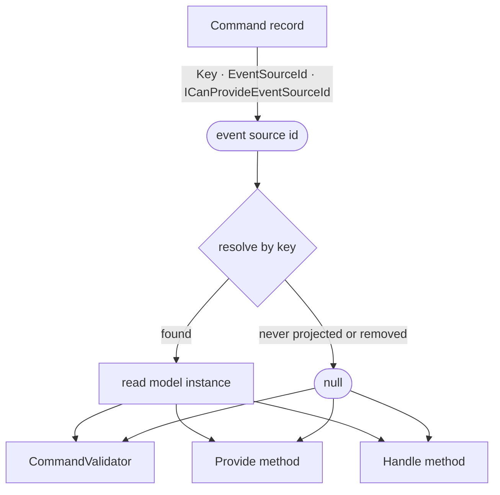

**Goal:** your command's decision depends on what's already true. Can this order be submitted? Is this name taken? What's the current balance? The state you need is already projected into a read model — you just need it *inside* the command.

You don't query for it. If the command carries a key, Arc has already resolved the read model for that key and will hand it to you as a parameter.

## The friction this removes

Without it, a command that needs current state has to go get it: inject a repository or `IReadModels`, resolve the key by hand, `await` a lookup, null-check the result. That's four lines of plumbing before the first line of the actual decision — repeated in the validator *and* the handler, where the two can drift apart and answer differently.

Arc removes the fetch entirely. Declare the read model as a parameter and it arrives:

```csharp
[Command]
public record SettleLedger(LedgerId LedgerId)
{
    public LedgerSettled Handle(LedgerBalance balance) => new(balance.Balance);
}
```

`LedgerBalance` is a read model built from ledger events. Arc resolved it for `LedgerId`, and the validator for this same command gets the *same* instance — one fetch per command, shared.

## How the resolution works

The key the command already uses to append events is the key the read model is resolved by. Nothing extra to configure.



Two things follow from that shape, and both matter:

- **A key proves *which* instance, not *that* it exists.** The projection may never have been created, or may have been removed. Resolution can legitimately yield nothing.
- **All three positions share one instance.** The validator, `Provide()`, and `Handle()` resolve from the same command scope, so they cannot disagree about the state they're looking at.

## Pick where the state is used

| You want to… | Put the read model in | Because |
|---|---|---|
| Reject the command with a message | `CommandValidator<TCommand>` | Rules stay with the command's other rules; the message reaches the UI as a validation error |
| Feed a value into the decision | `Handle()` | The event you produce is computed *from* the state |
| Combine it with fetched data first | `Provide()` | `Provide` acquires, `Handle` decides — see [Provide data to a command handler](./provide-data-to-a-command.md) |

### Reject: put it in the validator

A validator constructor takes the read model like any other dependency:

```csharp
public class SettleLedgerValidator : CommandValidator<SettleLedger>
{
    public SettleLedgerValidator(LedgerBalance balance) =>
        RuleFor(command => command.LedgerId)
            .Must(_ => balance.Balance > 0)
            .WithMessage("Ledger has no funds to settle.");
}
```

The command never reaches `Handle()`, and the message surfaces in the UI through the generated proxy like any other validation error.

### Decide: put it in `Handle()`

When the state is an *input* to the event rather than a gate on it, take it in the handler:

```csharp
[Command]
public record WithdrawFunds(AccountId AccountId, decimal Amount)
{
    public FundsWithdrawn Handle(AccountBalance balance) =>
        new(Amount, balance.Balance - Amount);
}
```

## Say what a missing read model means

This is the one decision the framework can't make for you, so make it deliberately: **nullable means you handle absence, non-nullable means you require existence.**

Nullable — absence is a normal business condition, and the rule is written around it:

```csharp
public class RegisterCustomerValidator : CommandValidator<RegisterCustomer>
{
    public RegisterCustomerValidator(Customer? customer) =>
        RuleFor(_ => customer)
            .Null()
            .WithMessage("Customer is already registered");
}
```

Non-nullable — the projection is required, and its absence is a fault rather than an outcome. Arc fails the command with `ReadModelDoesNotExistForCommand` (HTTP 400) before your code runs, so you write the rule against the state directly:

```csharp
public class SubmitOrderValidator : CommandValidator<SubmitOrder>
{
    public SubmitOrderValidator(OrderReadModel order) =>
        RuleFor(_ => order.Status)
            .Equal(OrderStatus.ReadyForSubmission)
            .WithMessage("Only orders that are ready for submission can be submitted");
}
```

The analyzer warns ([ARC0006](../backend/code-analysis/ARC0006.md)) on every non-nullable read model parameter — not because it's wrong, but so the choice is a decision rather than an oversight.

:::caution[Read models are eventually consistent]
The instance you get reflects events processed *so far*. That is exactly right for gating on projected state ("this order isn't ready", "this account is frozen"), and wrong for an invariant that must hold under concurrent commands — two racing registrations can both read "name not taken". For invariants, use a Chronicle [constraint](/chronicle/constraints/), which is enforced at append time.
:::

## Which read models can be injected

Any read model Chronicle can resolve **by key** — which means one with a Chronicle backing artifact:

- a fluent [`IProjectionFor<T>`](/chronicle/projections/) projection
- a model-bound projection (`[FromEvent<T>]`, `[SetFrom<T>]`, `[SetValue<T>]`)
- an [`IReducerFor<T>`](/chronicle/reducers/) reducer

You write the parameter identically in all three cases — the backing artifact is an implementation detail. Note that the `[ReadModel]` attribute **alone** does not make a type injectable: it's an Arc query concept and can be backed by stores that have no key resolution. Backing decides, not the attribute.

## Test it without mocking

Seed the state the command should observe, then execute. Either state the events behind it:

```csharp
void Establish() =>
    _scenario.Given
        .ForEventSource(_accountId)
        .Events(new MoneyDeposited(100m), new MoneyDeposited(50m));
```

…or pin the instance when the events aren't the point:

```csharp
void Establish() =>
    _scenario.Given
        .ForEventSource(_accountId)
        .ReadModel(new AccountBalance(150m));
```

An unseeded event source resolves to `null`, exactly as in production. See [Testing with Chronicle](../backend/testing/chronicle.md) for the full harness.

## See also

- [Read models in commands](../backend/chronicle/read-models/injecting-into-commands.md) — the full reference for all three positions.
- [When resolution fails](../backend/chronicle/read-models/failures.md) — every error you can hit, and what it means.
- [Validate a command](./validate-a-command.md) — the other three places a rule can live.
- [Resolving EventSourceId](../backend/chronicle/resolving-event-source-id.md) — how the key itself is found.
