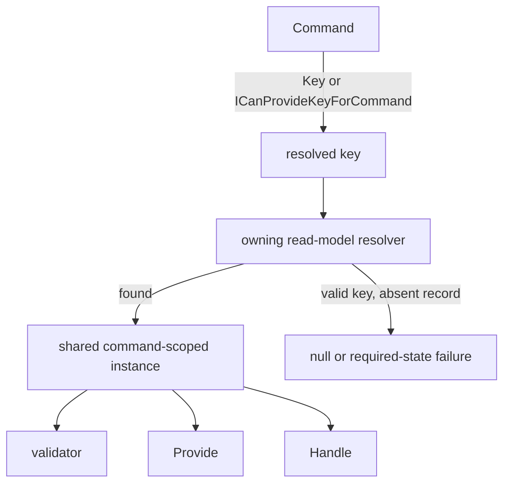

**Goal:** decide against existing state without repeating the same lookup in a validator, `Provide()`, and `Handle()`.

Arc can resolve a read model once in the command scope and share that instance between those positions. This needs **both a usable command key and a provider that owns key-based resolution**. `[ReadModel]` alone is not a storage configuration.

## Declare the key and provider

Standalone Arc resolves keys from `[Key]` or `ICanProvideKeyForCommand.GetKey()`. It does not guess from a property named `Id` or from an arbitrary Guid concept. A composite application key can be composed by that interface, but the selected provider must still support the resulting stored key.



| Provider             | What enables resolution                                                                                                                      |
| -------------------- | -------------------------------------------------------------------------------------------------------------------------------------------- |
| MongoDB              | Configured Arc MongoDB integration discovers `[ReadModel]` candidates as fallback ownership and loads by mapped document id                  |
| EF Core              | A registered `ReadOnlyDbContext` owns a `[ReadModel]` entity through `DbSet<T>`; resolution currently requires a single-property primary key |
| Chronicle (optional) | A projection or reducer supplies declared ownership and integration-specific event-source key resolution                                     |

A normal writable `BaseDbContext` like the tutorial's `LibraryDbContext` is **not enough to establish EF command-read-model ownership**. Keep method-injecting that context for explicit lookups/writes, or configure a [read-only context](/arc/backend/entity-framework/read-only/) intentionally. Configured auto-discovery is supported; do not duplicate it with mandatory manual registration.

## Write against standalone state

This complete command declaration uses the [MongoDB tutorial's setup, imports, and author types](/arc/backend/getting-started/your-first-command/). Add the shown key import to the file:

```csharp
using System.ComponentModel.DataAnnotations;

namespace Library.Authors;

[Command]
public record RenameAuthor([property: Key] AuthorId Id, AuthorName NewName)
{
    public Task Handle(Author author, IMongoCollection<Author> authors) =>
        authors.ReplaceOneAsync(existing => existing.Id == author.Id, author with { Name = NewName });
}
```

Arc loads the author for `Id`, then injects it alongside the collection. The explicit replacement persists the change. A returned DTO alone would not.

## Choose the decision point

| Need                                       | Position                     |
| ------------------------------------------ | ---------------------------- |
| Reject with a friendly message before work | `CommandValidator<TCommand>` |
| Acquire data using current state           | `Provide()`                  |
| Compute and perform the write or response  | `Handle()`                   |

For example, a **validator fragment** in the same namespace can reject a rename to the current name:

```csharp
public class RenameAuthorValidator : CommandValidator<RenameAuthor>
{
    public RenameAuthorValidator(Author? author)
    {
        RuleFor(command => command.Id)
            .Must(_ => author is not null)
            .WithMessage("Author does not exist.");
        When(_ => author is not null, () =>
            RuleFor(command => command.NewName)
                .Must(name => name != author!.Name)
                .WithMessage("Choose a different name."));
    }
}
```

The nullable validator can turn absence into a business rejection before the non-nullable handler runs. See [Provide data to a command handler](./provide-data-to-a-command.md) for combining state with external data.

## Say what absence means

- **Nullable:** a valid key with no record supplies `null`; write the business rule around that possibility.
- **Non-nullable:** the instance is required. Missing state produces `ReadModelDoesNotExistForCommand` as a validation failure (HTTP 400), rather than invoking your code with a fabricated model.
- **No usable key:** even a nullable parameter cannot mean “not found” when Arc cannot identify what to fetch. Key-resolution failure is separate from absence.

For registration, absence can be the **desired** state. This alternative domain fragment assumes a keyed `RegisterCustomer` and a provider-owned `Customer`:

```csharp
public class RegisterCustomerValidator : CommandValidator<RegisterCustomer>
{
    public RegisterCustomerValidator(Customer? customer) =>
        RuleFor(_ => customer).Null().WithMessage("Customer is already registered.");
}
```

For an operation requiring an existing order, a non-nullable dependency can instead express that precondition. This fragment assumes a keyed `SubmitOrder`, a provider-owned `OrderReadModel`, and an application `OrderStatus` enum:

```csharp
public class SubmitOrderValidator : CommandValidator<SubmitOrder>
{
    public SubmitOrderValidator(OrderReadModel order) =>
        RuleFor(_ => order.Status)
            .Equal(OrderStatus.ReadyForSubmission)
            .WithMessage("Only orders that are ready for submission can be submitted.");
}
```

[ARC0006](../backend/code-analysis/ARC0006.md) warns on non-nullable read-model dependencies so the choice is explicit.

A shared instance prevents duplicate lookups; it is **not a lock, transaction, or freshness guarantee**. Other commands can change the database after it was read. Protect hard invariants with database constraints or an atomic conditional write/transaction. Chronicle projections may additionally lag their events; its [constraints](/chronicle/constraints/) enforce supported invariants at append time.

## Optional: projected state with Chronicle

With [Chronicle integration](../backend/chronicle/index.md), read models can be backed by fluent `IProjectionFor<T>`, model-bound projection attributes, or `IReducerFor<T>`. Integration-specific key resolution can use event-source identifiers. The same injection positions apply.

These are **integrated domain fragments**, assuming an event-source `LedgerId` / `AccountId`, configured projections, and registered event types; they do not persist anything in standalone Core:

```csharp
[Command]
public record SettleLedger(LedgerId LedgerId)
{
    public LedgerSettled Handle(LedgerBalance balance) => new(balance.Balance);
}

[Command]
public record WithdrawFunds(AccountId AccountId, decimal Amount)
{
    public FundsWithdrawn Handle(AccountBalance balance) =>
        new(Amount, balance.Balance - Amount);
}
```

A `SettleLedgerValidator` can reject a nonpositive `balance.Balance`; an order validator can similarly gate on `ReadyForSubmission`. Those are state checks, not concurrency guarantees.

Chronicle testing can seed either events or a pinned read model. These are **alternative setup fragments** for a configured Chronicle command scenario:

```csharp
void Establish() =>
    _scenario.Given.ForEventSource(_accountId)
        .Events(new MoneyDeposited(100m), new MoneyDeposited(50m));
```

```csharp
void Establish() =>
    _scenario.Given.ForEventSource(_accountId)
        .ReadModel(new AccountBalance(150m));
```

See [Chronicle testing](../backend/testing/chronicle.md) for the complete fixture. Standalone tests instead seed their provider or register application-service fakes as in [Test a command](./test-a-command.md).

## See also

- [Read models from other providers](../backend/chronicle/read-models/other-providers.md) — provider ownership and explicit standalone keys.
- [Resolution failures](../backend/chronicle/read-models/failures.md) — distinguish missing state, missing keys, and configuration errors.
- [Validate a command](./validate-a-command.md) — choose the narrowest place for a rule.
- [Chronicle event-source resolution](../backend/chronicle/resolving-event-source-id.md) — optional integration key conventions.
