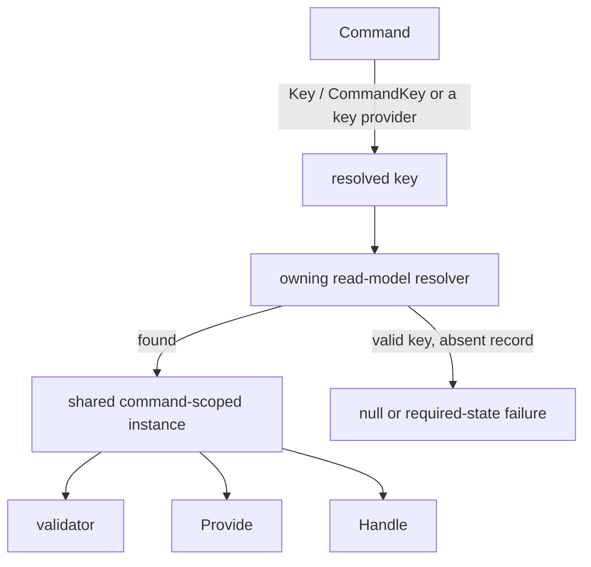

**Goal:** decide against existing state without repeating the same lookup in a validator, `Provide()`, and `Handle()`.

Arc can resolve a read model once in the command scope and share that instance between the positions the backend supports. This needs **both a usable command key and a provider that owns key-based resolution**. Marking the type `[ReadModel]` (C#) or `@ReadModel` (JVM) is not by itself a storage configuration.

## Declare the key and provider

Standalone Arc resolves keys from `[Key]` or `ICanProvideKeyForCommand.GetKey()` in C#, and from `@CommandKey` or `CommandKeyProvider.commandKey()` on the JVM. Neither backend guesses from a property named `Id` or from an arbitrary Guid concept, and both allow at most one declared key. A composite application key can be composed by the provider interface, but the selected provider must still support the resulting stored key.

| Provider                         | What enables resolution                                                                                                                      |
| -------------------------------- | -------------------------------------------------------------------------------------------------------------------------------------------- |
| MongoDB                          | Configured Arc MongoDB integration discovers read-model candidates as fallback ownership and loads by mapped document id                     |
| EF Core (C#)                     | A registered `ReadOnlyDbContext` owns a `[ReadModel]` entity through `DbSet<T>`; resolution currently requires a single-property primary key |
| Spring Data JPA / MongoDB (JVM)  | The integrations contribute storage-neutral `CanResolveReadModelForCommand` providers for exact mapped `@ReadModel` types; JPA claims `DECLARED` ownership, MongoDB `FALLBACK` |
| Chronicle (optional)             | A projection or reducer supplies declared ownership and integration-specific event-source key resolution                                     |

A normal writable `BaseDbContext` like the tutorial's `LibraryDbContext` is **not enough to establish EF command-read-model ownership**. Keep method-injecting that context for explicit lookups/writes, or configure a [read-only context](/arc/backend/csharp/entity-framework/read-only/) intentionally. Configured auto-discovery is supported; do not duplicate it with mandatory manual registration.

On the JVM, equal-strength claims for the same type fail startup rather than picking a store by bean order, and a registry-owned read-model parameter is resolved before ordinary Spring services, so a bean of the model class cannot bypass tenant or key selection.

## Write against standalone state

This command declaration uses the [MongoDB tutorial's setup, imports, and author types](/arc/backend/csharp/getting-started/your-first-command/). Add the shown key import to the file:

<ArcBackendTabs snippet="scenarios/use-current-state-in-a-command/rename-author" />

Arc loads the author for the command key, then injects it alongside the collection or repository that performs the write. The explicit replacement persists the change. A returned DTO alone would not.

## Choose the decision point

| Need                                       | Position                                       |
| ------------------------------------------ | ---------------------------------------------- |
| Reject with a friendly message before work | `CommandValidator<TCommand>`                   |
| Acquire data using current state           | `Provide()` / `provide`                        |
| Compute and perform the write or response  | `Handle()` / `handle`                          |

All three positions receive the provider-owned instance in C#. On the JVM the registry resolves it for `provide` and `handle`; a validator that needs current state injects its own repository, as the fragments below show.

:::tip[Use current state to decide the write]
Keep state acquisition in the provider or `Provide()`. On the C# backend, for immediate inline writes, prefer returning a [command operation](../backend/csharp/commands/operations/index.md) from `Handle()` describing the chosen replacement; Arc executes it afterward. The direct replacement above remains supported. Moving execution does not make the acquired state fresh or remove the need for database constraints and atomic conditional writes.
:::

For example, a **validator fragment** beside the command can reject a rename to the current name:

<ArcBackendTabs snippet="scenarios/use-current-state-in-a-command/rename-author-validator" />

In C# the nullable validator parameter turns absence into a business rejection before the non-nullable handler runs. **Provider-owned resolution reaches the JVM validator differently:** Arc.Kotlin resolves an owned read model for the `handle` and `provide` parameters, not into a `CommandValidator` constructor, so the JVM sibling injects its own repository and looks the author up itself. The rule, the message, and the member it is reported against are the same. See [Provide data to a command handler](./provide-data-to-a-command.mdx) for combining state with external data.

## Say what absence means

- **Nullable:** a valid key with no record supplies `null`; write the business rule around that possibility. On the JVM a Kotlin `T?` parameter observes `null` and an ordinary Java `Optional<T>` observes `Optional.empty()`.
- **Non-nullable:** the instance is required. Missing state produces `ReadModelDoesNotExistForCommand` as a validation failure (HTTP 400) in C#, and one `dependencyUnavailable` validation result and HTTP 400 on the JVM — rather than invoking your code with a fabricated model.
- **No usable key:** even a nullable parameter cannot mean “not found” when Arc cannot identify what to fetch. Key-resolution failure is separate from absence.

For registration, absence can be the **desired** state. This alternative domain fragment assumes a keyed `RegisterCustomer` and a provider-owned `Customer`:

<ArcBackendTabs snippet="scenarios/use-current-state-in-a-command/register-customer-validator" />

For an operation requiring an existing order, a non-nullable dependency can instead express that precondition. This fragment assumes a keyed `SubmitOrder`, a provider-owned order read model, and an application `OrderStatus` enum:

<ArcBackendTabs snippet="scenarios/use-current-state-in-a-command/required-order-state" />

The two tabs put the same statement in the position each backend supports. C# declares the requirement on the validator's non-nullable constructor parameter; the JVM declares it on the handler's non-nullable parameter, because that is where an owned read model is resolved there. Either way, a missing record rejects the command before your code decides anything.

[ARC0006](../backend/csharp/code-analysis/ARC0006.md) warns on non-nullable read-model dependencies in C# so the choice is explicit.

A shared instance prevents duplicate lookups; it is **not a lock, transaction, or freshness guarantee**. Other commands can change the database after it was read. Protect hard invariants with database constraints or an atomic conditional write/transaction. Chronicle projections may additionally lag their events; its [constraints](/chronicle/constraints/) enforce supported invariants at append time.

## Optional: projected state with Chronicle

With [Chronicle integration](../backend/csharp/chronicle/index.md), read models can be backed by fluent `IProjectionFor<T>`, model-bound projection attributes, or `IReducerFor<T>`. Integration-specific key resolution can use event-source identifiers. The same injection positions apply.

These are **integrated domain fragments**, assuming an event-source `LedgerId` / `AccountId`, configured projections, and registered event types; they do not persist anything in standalone Core:

<ArcBackendTabs snippet="scenarios/use-current-state-in-a-command/chronicle-commands" />

The event-source identity is stated differently. C# also accepts an `EventSourceId<T>`-derived property as the identity candidate, so `SettleLedger` needs no attribute; Arc.Kotlin reads `CommandContext.commandKey`, so the identifying property carries `@CommandKey` and a command returning events without a resolvable key is rejected rather than appended to the wrong stream.

A `SettleLedgerValidator` can reject a nonpositive balance; an order validator can similarly gate on `ReadyForSubmission`. Those are state checks, not concurrency guarantees.

Chronicle testing can seed either events or a pinned read model. These are **alternative setup fragments** for a configured Chronicle command scenario:

<ArcBackendTabs snippet="scenarios/use-current-state-in-a-command/seed-events" />

<ArcBackendTabs snippet="scenarios/use-current-state-in-a-command/pin-read-model" />

Seeding events is the same idea on both backends: state the facts for the event source and let every read model derived from them materialize. Pinning is where they differ — C# pins through the Chronicle-specific `Given.ForEventSource(id).ReadModel(...)`, while Arc.Kotlin pins through the scenario's own ownership registry with `withReadModelForKey`, which works identically for a Chronicle-, JPA-, or MongoDB-owned read model and also proves the command carries the key it should.

See [Chronicle testing](../backend/csharp/testing/chronicle.md) and the [JVM testing guide](/arc/backend/kotlin/guides/testing/) for the complete fixtures. Standalone tests instead seed their provider or register application-service fakes as in [Test a command](./test-a-command.mdx).

## See also

- [Read models from other providers](../backend/csharp/chronicle/read-models/other-providers.md) — provider ownership and explicit standalone keys.
- [Resolution failures](../backend/csharp/chronicle/read-models/failures.md) — distinguish missing state, missing keys, and configuration errors.
- [Validate a command](./validate-a-command.mdx) — choose the narrowest place for a rule.
- [Chronicle event-source resolution](../backend/csharp/chronicle/resolving-event-source-id.md) — optional integration key conventions.
- [Identify a command with a key](/arc/backend/kotlin/guides/command-keys/) — `@CommandKey` and `CommandKeyProvider` on the JVM.
- [Repositories in queries and commands](/arc/backend/kotlin/guides/spring-data/repositories/) — JVM provider ownership, tenancy, and absence behavior.
