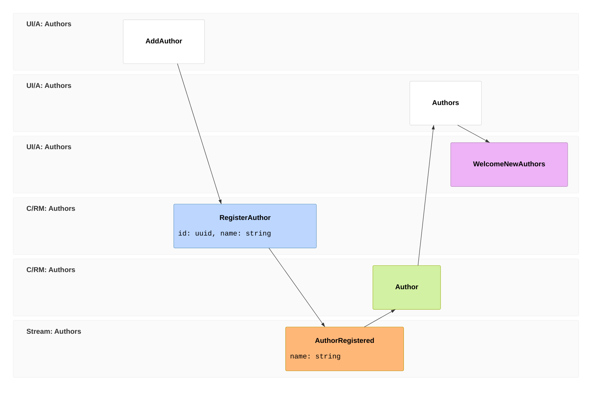

import { Aside } from '@astrojs/starlight/components';
import FullStackTabs from '@components/FullStackTabs.astro';

You have a complete, typed, live full-stack app — and not an event anywhere in it. That's a perfectly good place to stop. But the day **history** starts to matter — an audit trail, the ability to rebuild a read model a brand-new way, temporal queries, or automation that fires on facts — you reach for [Chronicle](/chronicle/), Arc's event-sourcing engine.

The reassuring part: adopting it is a **write-side change**. Your queries, your generated proxies, and your React screens don't move.

You drew this slice as an **[event model](/event-modeling/)** back in the [tutorial intro](/arc/tutorial/), and it barely changes here. The screen, the command, the `AuthorRegistered` fact, the read model, and the query all stay put. What changes is *where the fact lives* — a database row becomes a real, stored event — and that unlocks one genuinely new block: a **reactor** (frame `06`), automation that fires *when a fact happens*.



Frames `01`–`05` are unchanged from the intro — the fact at `03` is just stored differently now. Frame `06` is the new part: a reactor, which you couldn't have before because there were no stored events to react to. Let's prove it on the very first slice.

## What changes, and what doesn't

Set the two versions of the author slice side by side.

**The command stops writing a document and starts recording a fact.** `Handle()` returns the event that happened instead of inserting:

```csharp
[Command]
public record RegisterAuthor(AuthorId Id, AuthorName Name)
{
    public AuthorRegistered Handle() => new(Name);   // returns the fact, doesn't write
}

[EventType]
public record AuthorRegistered(AuthorName Name);
```

The event is an immutable, past-tense fact. `[EventType]` carries **no name argument** — Chronicle uses the type name, `AuthorRegistered`, as its identity. For Chronicle to use an author's id as the key of their event stream, give the concept an implicit conversion to `EventSourceId`:

```csharp
public record AuthorId(Guid Value) : ConceptAs<Guid>(Value)
{
    public static AuthorId New() => new(Guid.NewGuid());
    public static implicit operator EventSourceId(AuthorId id) => new(id.Value.ToString());
}
```

**The read model stops being filled by the command and starts being filled by a projection.** Mark it `[FromEvent<T>]` and Chronicle folds the event onto it — **AutoMap** matches `AuthorRegistered.Name` straight onto `Author.Name`, so you write no update code:

```csharp
[ReadModel]
[FromEvent<AuthorRegistered>]
public record Author([property: Key] AuthorId Id, AuthorName Name)
{
    // The query is UNCHANGED from chapter 1.
    public static ISubject<IEnumerable<Author>> AllAuthors(IMongoCollection<Author> collection) =>
        collection.Observe();
}
```

That's the whole migration for this slice. Lined up:

| | Over a database (chapters 1–5) | With Chronicle |
| --- | --- | --- |
| What `Handle()` does | writes a document | returns an event |
| What fills the read model | the command, directly | a projection over the event |
| What you can read | current state | current state **and full history** |
| The query method | `AllAuthors` | `AllAuthors` — *identical* |
| The generated proxies & React | as built | *identical* |

## The frontend doesn't notice

The query is the same method, so the generated proxy is the same type, so the screen you wrote in chapter 1 keeps working untouched — it's still subscribed to the read model, which a projection now keeps current instead of the command:

<FullStackTabs>
  <Fragment slot="csharp">
  ```csharp
  // the read model is now event-sourced — the query signature is unchanged
  public static ISubject<IEnumerable<Author>> AllAuthors(IMongoCollection<Author> collection) =>
      collection.Observe();
  ```
  </Fragment>
  <Fragment slot="typescript">
  ```tsx
  // not one character changes
  const [authors] = AllAuthors.use();
  ```
  </Fragment>
</FullStackTabs>

## What the events unlock

Now that state changes are recorded as facts, you get things a plain database can't give you:

- **A free audit trail** — every change, in order, forever.
- **Rebuild read models from history** — model a brand-new view of the past by replaying the events into it.
- **Reactors** — automate a follow-up *when a fact happens*. A reactor is a class marked `IReactor`; the method's first parameter is the event it reacts to:

  ```csharp
  public class WelcomeNewAuthors(INotificationService notifications) : IReactor
  {
      public Task AuthorRegistered(AuthorRegistered @event, EventContext context) =>
          notifications.Notify($"Welcome aboard, {@event.Name}!");
  }
  ```

  <Aside type="note">
  This is why the live-screen chapter was just *observable queries* and not "make it react" — reactions fire on **events**, and you didn't have any until now. Reactors are an event-sourcing feature.
  </Aside>

## When it's worth it — and where to go next

Storing current state directly is simpler, and for plenty of apps it's the right call. Event sourcing earns its keep when history, auditability, or replay matter. [Why Event Sourcing](/chronicle/why-event-sourcing/) is the honest look at the trade-off — including when *not* to reach for it.

You don't have to decide up front. You just saw the move: the read side and the entire frontend came along unchanged.

- **The event-sourcing side, in depth** — the [Chronicle tutorial](/chronicle/tutorial/) builds the same library model one event-sourcing concept at a time.
- **The two together, end to end** — the [Cratis Stack tour](/cratis-stack/) and the [full-stack capstone](/build-a-full-app/) put Arc, Chronicle, and Components together on a real feature.
- **Adopt it incrementally** — [Adopting Cratis](/adopting-cratis/) walks through moving an existing Arc app's write side to Chronicle, one slice at a time.

That's the library — built full-stack and type-safe over a database, with a clear, low-cost path to event sourcing the day you need it. You have the model; go build your own.
