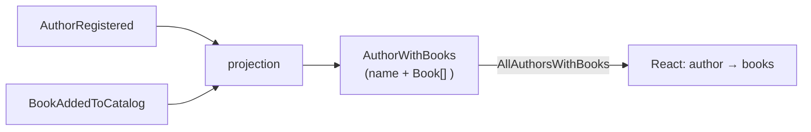

import { Steps, Aside } from '@astrojs/starlight/components';

An author exists to have written things. So our second feature is **adding a book to an author's catalog** — and it's the first time two slices in our app relate to each other. This is where event sourcing earns its keep: we won't store a foreign key and join at read time. Instead, a projection will *fold* two different events — `AuthorRegistered` and a new `BookAddedToCatalog` — into a single read model where each author already carries their list of books.

Here's the shape:



## The book slice

A book belongs to an author, so the command is **keyed by the author** — every book event lands in that author's stream, which is exactly what lets the projection attach it to the right author later.

<Steps>

1. **Strong types for the book.** Same discipline as before:

   ```csharp
   public record BookId(Guid Value) : ConceptAs<Guid>(Value)
   {
       public static BookId New() => new(Guid.NewGuid());
   }

   public record BookTitle(string Value) : ConceptAs<string>(Value)
   {
       public static implicit operator BookTitle(string value) => new(value);
   }
   ```

2. **The command and its event.** The command is keyed by `AuthorId`, and carries the new `BookId` and `BookTitle`. The event records all three — the author it belongs to, the book's own id, and the title:

   ```csharp
   [Command]
   public record AddBook([Key] AuthorId AuthorId, BookId BookId, BookTitle Title)
   {
       public BookAddedToCatalog Handle() => new(AuthorId, BookId, Title);
   }

   [EventType]
   public record BookAddedToCatalog(AuthorId AuthorId, BookId BookId, BookTitle Title);
   ```

</Steps>

## One read model, folded from two events

Now the interesting part. We want a read model where every author *contains* their books, built without a single line of join logic. Declare the child shape, then declare the parent with a `[ChildrenFrom<…>]` property that tells the projection how to attach children to their parent:

```csharp
[FromEvent<BookAddedToCatalog>]
public record Book([Key] BookId Id, BookTitle Title);

[ReadModel]
[FromEvent<AuthorRegistered>]
public record AuthorWithBooks(
    [Key] AuthorId Id,
    AuthorName Name,
    [ChildrenFrom<BookAddedToCatalog>(parentKey: nameof(BookAddedToCatalog.AuthorId), identifiedBy: nameof(Book.Id))]
    IEnumerable<Book> Books)
{
    public static ISubject<IEnumerable<AuthorWithBooks>> AllAuthorsWithBooks(IMongoCollection<AuthorWithBooks> collection) =>
        collection.Observe();
}
```

<Aside type="tip" title="Read the attribute out loud">
`[ChildrenFrom<BookAddedToCatalog>(parentKey: …AuthorId, identifiedBy: …Id)]` says: *"the `Books` list is built from `BookAddedToCatalog` events; attach each one to the author whose id equals the event's `AuthorId`, and identify each book by its `Id`."* That's the whole relationship — declared, not coded. AutoMap fills `Book.Title` from the event, and Chronicle keeps the list in sync as books are added.
</Aside>

So `AllAuthorsWithBooks` returns each author already carrying their catalog. There's no second query, no client-side stitching, and — because it's `Observe()` — it stays live.

## Showing the catalog

The query proxy is generated like any other, and now each author has a `books` array to map over:

```tsx title="Catalog.tsx"
import { AllAuthorsWithBooks } from './Authors/AuthorWithBooks';   // generated proxy

export const Catalog = () => {
    const [authors] = AllAuthorsWithBooks.use();
    return (
        <ul>
            {authors.data.map(author => (
                <li key={String(author.id)}>
                    {author.name}
                    <ul>
                        {author.books.map(book => <li key={String(book.id)}>{book.title}</li>)}
                    </ul>
                </li>
            ))}
        </ul>
    );
};
```

Adding a book is a `CommandDialog<AddBook>`, exactly like `RegisterAuthor` — the only difference is that it carries the `authorId` of the author you're adding to. Pass that in as an initial value:

```tsx title="AddBook.tsx"
<CommandDialog<AddBook>
    command={AddBook}
    title="Add book"
    okLabel="Add"
    initialValues={{ authorId, bookId: Guid.create() }}>
    <InputTextField<AddBook> value={i => i.title} title="Title" />
</CommandDialog>
```

<Aside type="note" title="Why initialValues, not onBeforeExecute">
The `authorId` is context the form needs to be *valid* from the start, so it goes in `initialValues`. Values you compute at execution time and that don't affect validity (like a generated id) can go in `onBeforeExecute` instead. See [Dialogs](/components/) for the full pattern.
</Aside>

## What you built

- A second slice — `AddBook` — keyed to the author it belongs to.
- A **relationship expressed as a projection**: `AuthorWithBooks` folds two event types into one read model, with `[ChildrenFrom<…>]` doing the attaching and no join code.
- A React screen that renders authors and their books from a single live query.

Two features, related, with the read side doing the heavy lifting. But notice we keep saying "it stays live" without really showing it — and we haven't done anything *automatically* when a book is added. Next we'll make the live updates concrete and add our first reactor. [Let's make it move →](./real-time)
