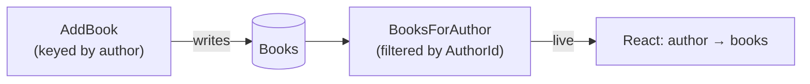

import { Steps, Aside, Tabs, TabItem } from '@astrojs/starlight/components';

An author exists to have written things. So our second feature is **adding a book to an author's catalog** — and it's the first time two slices in our app relate to each other. A book belongs to an author; we'll model that with a plain foreign key — the author's id on the book — and read a catalog back with a **filtered** query.

Here's the shape:



## The book slice

<Steps>

1. **Strong types for the book.** Same discipline as before:

   ```csharp
   public record BookId(Guid Value) : ConceptAs<Guid>(Value)
   {
       public static BookId New() => new(Guid.NewGuid());
   }

   public record BookTitle(string Value) : ConceptAs<string>(Value)
   {
       public static implicit operator BookTitle(string value) => new(value);
   }
   ```

2. **The command writes a book, tagged with its author.** `AddBook` carries the `AuthorId` it belongs to — and writes a `Book` carrying that id:

   <Tabs syncKey="db">
   <TabItem label="MongoDB" icon="seti:db">
   ```csharp
   [Command]
   public record AddBook(AuthorId AuthorId, BookId BookId, BookTitle Title)
   {
       public Task Handle(IMongoCollection<Book> books) =>
           books.InsertOneAsync(new Book(BookId, AuthorId, Title));
   }
   ```
   </TabItem>
   <TabItem label="EF Core" icon="seti:db">
   ```csharp
   [Command]
   public record AddBook(AuthorId AuthorId, BookId BookId, BookTitle Title)
   {
       public async Task Handle(LibraryDbContext db)
       {
           db.Books.Add(new Book(BookId, AuthorId, Title));
           await db.SaveChangesAsync();
       }
   }
   ```
   </TabItem>
   </Tabs>

</Steps>

## Read a catalog back, filtered

The read model is just the book document — it carries the `AuthorId` it belongs to. The query takes the author's id (Arc binds it by matching the parameter name) and returns only that author's books, live:

<Tabs syncKey="db">
<TabItem label="MongoDB" icon="seti:db">
```csharp
[ReadModel]
public record Book(BookId Id, AuthorId AuthorId, BookTitle Title)
{
    public static ISubject<IEnumerable<Book>> BooksForAuthor(AuthorId authorId, IMongoCollection<Book> books) =>
        books.Observe(b => b.AuthorId == authorId);
}
```
</TabItem>
<TabItem label="EF Core" icon="seti:db">
```csharp
[ReadModel]
public record Book(BookId Id, AuthorId AuthorId, BookTitle Title)
{
    public static ISubject<IEnumerable<Book>> BooksForAuthor(AuthorId authorId, LibraryDbContext db) =>
        db.Books.Observe(b => b.AuthorId == authorId);

    // add the DbSet to LibraryDbContext: public DbSet<Book> Books => Set<Book>();
}
```
</TabItem>
</Tabs>

<Aside type="tip" title="The relationship is a filter">
`Observe(b => b.AuthorId == authorId)` is the whole relationship: one collection of books, read back by the author they point at — and still live, because it's an observed query. No join, no second store.
</Aside>

## Showing the catalog

`BooksForAuthor` takes an author id, so it's a query *per author*. The list of authors comes from chapter 1's `AllAuthors`; each row renders its own live catalog:

```tsx title="Catalog.tsx"
import { AllAuthors } from './Authors/Author';
import { BooksForAuthor } from './Books/Book';   // generated proxies

const AuthorBooks = ({ authorId }: { authorId: string }) => {
    const [books] = BooksForAuthor.use(authorId);   // live, scoped to this author
    return <ul>{books.data.map(b => <li key={String(b.id)}>{b.title}</li>)}</ul>;
};

export const Catalog = () => {
    const [authors] = AllAuthors.use();
    return (
        <ul>
            {authors.data.map(a => (
                <li key={String(a.id)}>{a.name}<AuthorBooks authorId={String(a.id)} /></li>
            ))}
        </ul>
    );
};
```

Adding a book is a `CommandDialog<AddBook>`, exactly like `RegisterAuthor` — the only difference is that it carries the `authorId` of the author you're adding to. Pass that in as an initial value:

```tsx title="AddBook.tsx"
<CommandDialog<AddBook>
    command={AddBook}
    title="Add book"
    okLabel="Add"
    initialValues={{ authorId, bookId: Guid.create() }}>
    <InputTextField<AddBook> value={i => i.title} title="Title" />
</CommandDialog>
```

<Aside type="note" title="Why initialValues, not onBeforeExecute">
The `authorId` is context the form needs to be *valid* from the start, so it goes in `initialValues`. Values you compute at execution time and that don't affect validity (like a generated id) can go in `onBeforeExecute` instead. See [Dialogs](/components/) for the full pattern.
</Aside>

## What you built

- A second slice — `AddBook` — that tags each book with the author it belongs to.
- A **relationship as a foreign key + a filtered query**: `BooksForAuthor` reads exactly one author's catalog, live, with no join.
- A React screen that composes the two: a list of authors, each rendering its own live catalog.

Two features, related, both live. We keep *saying* "it stays live" — next we'll make that concrete and watch a screen update itself the instant the data changes. [Let's make it live →](./real-time)
