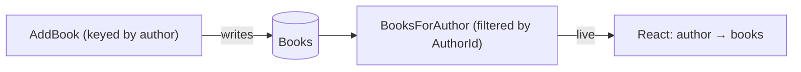

import { Steps, Aside, Tabs, TabItem } from '@astrojs/starlight/components';

An author exists to have written things. So our second feature is **adding a book to an author's catalog** — and it's the first time two slices in our app relate to each other. A book belongs to an author; we'll model that with a plain foreign key — the author's id on the book — and read a catalog back with a **filtered** query.

Here's the shape:


```mermaid
flowchart LR
    AB["AddBook (keyed by author)"] -->|writes| DB[("Books")]
    DB --> Q["BooksForAuthor (filtered by AuthorId)"]
    Q -->|live| UI["React: author → books"]
```

## The book slice

Continue from [chapter 2](/arc/tutorial/validation/), using its project and one database branch. Create `BookId.cs`, `BookTitle.cs`, `AddBook.cs`, and `Book.cs` under `src/Books/`, each with `namespace Library.Books;` above the declarations shown. Add `global using Library.Books;` to `GlobalUsings.cs`. Existing global imports supply the Arc, provider, and author types.

<Steps>

1. **Strong types for the book.** Same discipline as before:

   ```csharp
   public record BookId(Guid Value) : ConceptAs<Guid>(Value)
   {
       public static readonly BookId NotSet = new(Guid.Empty);

       public static BookId New() => new(Guid.NewGuid());
   }

   public record BookTitle(string Value) : ConceptAs<string>(Value)
   {
       public static readonly BookTitle NotSet = new(string.Empty);

       public static implicit operator BookTitle(string value) => new(value);
   }
   ```

2. **The command writes a book, tagged with its author.** `AddBook` carries the `AuthorId` it belongs to — and writes a `Book` carrying that id:

   <Tabs syncKey="db">
   <TabItem label="MongoDB" icon="seti:db">
   ```csharp
   [Command]
   public record AddBook(AuthorId AuthorId, BookId BookId, BookTitle Title)
   {
       public Task Handle(IMongoCollection<Book> books) =>
           books.InsertOneAsync(new Book(BookId, AuthorId, Title));
   }
   ```
   </TabItem>
   <TabItem label="EF Core" icon="seti:db">
   ```csharp
   [Command]
   public record AddBook(AuthorId AuthorId, BookId BookId, BookTitle Title)
   {
       public async Task Handle(LibraryDbContext db)
       {
           db.Books.Add(new Book(BookId, AuthorId, Title));
           await db.SaveChangesAsync();
       }
   }
   ```
   </TabItem>
   </Tabs>

</Steps>

## Read a catalog back, filtered

The read model is just the book document — it carries the `AuthorId` it belongs to. The query takes the author's id (Arc binds it by matching the parameter name) and returns only that author's books, live:

<Tabs syncKey="db">
<TabItem label="MongoDB" icon="seti:db">

```csharp
[ReadModel]
public record Book(BookId Id, AuthorId AuthorId, BookTitle Title)
{
    public static ISubject<IEnumerable<Book>> BooksForAuthor(AuthorId authorId, IMongoCollection<Book> books) =>
        books.Observe(b => b.AuthorId == authorId);
}
```

</TabItem>
<TabItem label="EF Core" icon="seti:db">

```csharp
[ReadModel]
public record Book(BookId Id, AuthorId AuthorId, BookTitle Title)
{
    public static ISubject<IEnumerable<Book>> BooksForAuthor(AuthorId authorId, LibraryDbContext db) =>
        db.Books.Observe(b => b.AuthorId == authorId);

}
```

</TabItem>
</Tabs>

For EF Core, also add `public DbSet<Book> Books => Set<Book>();` to `LibraryDbContext`. Apply the schema change before running: recreate only the disposable tutorial SQLite database as explained in [setup](/arc/backend/getting-started/), or use a migration for retained data. Re-register an author after recreating it. MongoDB creates its book collection on the first write.

Run `dotnet build -c Debug` before adding React. Verify `src/Books/AddBook.ts` and `src/Books/Book.ts` exist; the latter includes `BooksForAuthor` in source-file output mode.

<Aside type="tip" title="The relationship is a filter, not an existence constraint">
`Observe(b => b.AuthorId == authorId)` reads books carrying this author's id, without a join. The form supplies an existing author, but these examples do not prevent a direct caller from submitting an unknown id. Add server validation and, where supported, a database foreign-key constraint if author existence is a required invariant.
</Aside>

## Showing the catalog

`BooksForAuthor` takes an author id, so it's a query *per author*. The list of authors comes from chapter 1's `AllAuthors`; each row renders its own live catalog:

```tsx title="src/Catalog.tsx"
import { Guid } from '@cratis/fundamentals';
import { useDialog } from '@cratis/arc.react/dialogs';
import { AddBookDialog } from './AddBook';
import { AllAuthors } from './Authors/Author';
import { BooksForAuthor } from './Books/Book';   // generated proxies

const AuthorBooks = ({ authorId }: { authorId: Guid }) => {
    const [books] = BooksForAuthor.use({ authorId });   // live, scoped to this author
    return <ul>{books.data.map(b => <li key={String(b.id)}>{b.title}</li>)}</ul>;
};

export const Catalog = () => {
    const [authors] = AllAuthors.use();
    const [AddBookDialogWrapper, showAddBook] = useDialog(AddBookDialog);
    return (
        <>
            <ul>
                {authors.data.map(a => (
                    <li key={String(a.id)}>
                        {a.name}
                        <button onClick={() => void showAddBook({ authorId: a.id })}>Add book</button>
                        <AuthorBooks authorId={a.id} />
                    </li>
                ))}
            </ul>
            <AddBookDialogWrapper />
        </>
    );
};
```

Adding a book is a `CommandDialog<AddBook>`, exactly like `RegisterAuthor` — the only difference is that it carries the `authorId` of the author you're adding to. Pass that in as an initial value:

```tsx title="src/AddBook.tsx"
import { useState } from 'react';
import { Guid } from '@cratis/fundamentals';
import { CommandDialog } from '@cratis/components/CommandDialog';
import { InputTextField } from '@cratis/components/CommandForm';
import { AddBook } from './Books/AddBook';

export const AddBookDialog = ({ authorId }: { authorId: Guid }) => {
    const [bookId] = useState(() => Guid.create());
    return (
        <CommandDialog<AddBook>
            command={AddBook}
            title="Add book"
            okLabel="Add"
            initialValues={{ authorId, bookId }}>
            <InputTextField<AddBook> value={i => i.title} title="Title" />
        </CommandDialog>
    );
};
```

<Aside type="note" title="Why initialValues, not onBeforeExecute">
Both `authorId` and `bookId` are required and must be in `initialValues` before confirmation can become enabled. Keep the selected author's generated `Guid` value. Mount a fresh `AddBookDialog` per operation through the [dialog composition](/arc/frontend/react/dialogs/) and unmount on close: the id stays stable while editing but is not reused for the next book. `onBeforeExecute` cannot satisfy an unset required field.
</Aside>

## Mount the catalog

Replace `src/App.tsx` from chapter 1 with this composition: import `Catalog` instead of `Authors` and render `<Catalog />` instead of `<Authors />`. Keep the Add author action and both providers:

```tsx title="src/App.tsx"
import { Arc } from '@cratis/arc.react';
import { useDialog } from '@cratis/arc.react/dialogs';
import { CratisComponentsProvider } from '@cratis/components';
import { AddAuthor } from './AddAuthor';
import { Catalog } from './Catalog';

function Library() {
    const [AddAuthorDialog, showAddAuthor] = useDialog(AddAuthor);
    return (
        <>
            <button onClick={() => void showAddAuthor()}>Add author</button>
            <Catalog />
            <AddAuthorDialog />
        </>
    );
}

export const App = () => (
    <Arc>
        <CratisComponentsProvider>
            <Library />
        </CratisComponentsProvider>
    </Arc>
);
```

`Catalog` owns one dialog wrapper, outside the author loop. Each Add book button passes that row's `Guid` to `showAddBook`. The wrapper mounts `AddBookDialog` only while open and unmounts it on close, so its `bookId` state is fresh for the next operation.

## Check the relationship

Click **Add book** beside one author, add a book, then open the dialog again to add a second book. Verify that their ids differ and only that author's list grows. Another author's list should remain unchanged. Run `npx tsc --noEmit` and `npx vite build` from the frontend project root: `BooksForAuthor.use({ authorId })` requires a parameter object, not a positional id or a string conversion.

## What you built

- A second slice — `AddBook` — that tags each book with the author it belongs to.
- A **relationship as a foreign key + a filtered query**: `BooksForAuthor` reads exactly one author's catalog, live, with no join.
- A React screen that composes the two: a list of authors, each rendering its own live catalog.

Two features, related, both live. We keep *saying* "it stays live" — next we'll make that concrete and watch a screen update itself the instant the data changes. [Let's make it live →](/arc/tutorial/real-time/)
