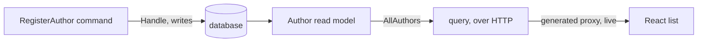

import { Steps, Aside, Tabs, TabItem } from '@astrojs/starlight/components';
import FullStackTabs from '@components/FullStackTabs.astro';

Every app starts with one feature. Ours is **registering an author** — the first thing a librarian does before they can catalog a single book. It's deliberately small, but building it touches the entire Arc loop: a command that expresses intent, the read model it updates, the query that serves it, and the React screen that calls both — all of it typed end to end.

In a layered app these would be files scattered across `Commands/`, `Handlers/`, and `ReadModels/`, and you'd jump between folders to follow one behavior. Arc doesn't force a layout on you — but we recommend the **vertical-slice** approach: a folder per feature, with a folder per slice inside it, mirroring the columns of your event model. That's how we'll build here: everything below lives in one `Authors/` folder you read top to bottom. Here's the slice we're about to build:



## The backend half

<Steps>

1. **Give the domain strong types.** Never thread raw `Guid`s and `string`s through your domain — wrap them so the compiler keeps them straight and your signatures document themselves:

   ```csharp
   public record AuthorId(Guid Value) : ConceptAs<Guid>(Value)
   {
       public static AuthorId New() => new(Guid.NewGuid());
   }

   public record AuthorName(string Value) : ConceptAs<string>(Value)
   {
       public static implicit operator AuthorName(string value) => new(value);
   }
   ```

2. **Write the command — with `Handle()` on the record.** A command is a `record` marked `[Command]`. The behavior lives in a `Handle()` method **on the record itself**; there's no separate handler class to hunt for. Here it writes the new author straight to the database:

   <Tabs syncKey="db">
   <TabItem label="MongoDB" icon="seti:db">
   ```csharp
   [Command]
   public record RegisterAuthor(AuthorId Id, AuthorName Name)
   {
       public Task Handle(IMongoCollection<Author> authors) =>
           authors.InsertOneAsync(new Author(Id, Name));
   }
   ```
   </TabItem>
   <TabItem label="EF Core" icon="seti:db">
   ```csharp
   [Command]
   public record RegisterAuthor(AuthorId Id, AuthorName Name)
   {
       public async Task Handle(LibraryDbContext db)
       {
           db.Authors.Add(new Author(Id, Name));
           await db.SaveChangesAsync();
       }
   }
   ```
   </TabItem>
   </Tabs>

   `Handle()` returns `Task` because there's nothing to report back — the write *is* the outcome. Arc injects the dependency it declares (the Mongo collection, or your `DbContext`) from the container.

3. **Declare the read model and its query.** The read model is just the shape you want to query, marked `[ReadModel]`. A static method **is** the query — return an observable so consumers get live updates:

   <Tabs syncKey="db">
   <TabItem label="MongoDB" icon="seti:db">
   ```csharp
   [ReadModel]
   public record Author(AuthorId Id, AuthorName Name)
   {
       public static ISubject<IEnumerable<Author>> AllAuthors(IMongoCollection<Author> collection) =>
           collection.Observe();
   }
   ```
   </TabItem>
   <TabItem label="EF Core" icon="seti:db">
   ```csharp
   [ReadModel]
   public record Author(AuthorId Id, AuthorName Name)
   {
       public static ISubject<IEnumerable<Author>> AllAuthors(LibraryDbContext db) =>
           db.Authors.Observe();
   }

   // A BaseDbContext registered via WithEntityFrameworkCore — see the EF integration guide.
   public class LibraryDbContext(DbContextOptions<LibraryDbContext> options) : BaseDbContext(options)
   {
       public DbSet<Author> Authors => Set<Author>();
   }
   ```
   </TabItem>
   </Tabs>

   <Aside type="tip" title="Notice what you didn't write">
   That static `AllAuthors` method *is* your query — Arc serves it over HTTP automatically. No controller, no routing, no DTO. And it's **live**: `.Observe()` watches the database's change stream (MongoDB's, or an [observed `DbSet`](/arc/backend/entity-framework/observing/)), so the instant the command writes, every subscribed browser re-renders.
   </Aside>

4. **Set up the project, then build.** Two pieces make the full-stack loop work: a build-time **proxy generator** and the **host wiring**. Add the packages and tell the generator where to write proxies — next to your source, so each `.ts` lands beside the `.tsx` that imports it:

   <Tabs syncKey="db">
   <TabItem label="MongoDB" icon="seti:db">
   ```xml title="Library.csproj"
   <ItemGroup>
       <PackageReference Include="Cratis.Arc" Version="*" />
       <PackageReference Include="Cratis.Arc.MongoDB" Version="*" />
       <PackageReference Include="Cratis.Arc.ProxyGenerator.Build" Version="*" />
   </ItemGroup>
   <PropertyGroup>
       <!-- Proxies are generated only when an output path is set -->
       <CratisProxiesOutputPath>$(MSBuildThisFileDirectory)</CratisProxiesOutputPath>
       <CratisProxiesUseSourceFileAsOutputFile>true</CratisProxiesUseSourceFileAsOutputFile>
   </PropertyGroup>
   ```

   Then wire the host. `AddCratisArc` registers Arc, `UseCratisMongoDB` points it at MongoDB, and `UseCratisArc` maps the command, query, and observable-query endpoints:

   ```csharp title="Program.cs"
   var builder = WebApplication.CreateBuilder(args);
   builder.AddCratisArc();
   builder.UseCratisMongoDB();
   builder.Services.AddControllers();

   var app = builder.Build();
   app.UseRouting();
   app.MapControllers();
   app.UseCratisArc();          // maps the command, query, and observable-query endpoints

   await app.RunAsync();
   ```
   </TabItem>
   <TabItem label="EF Core" icon="seti:db">
   ```xml title="Library.csproj"
   <ItemGroup>
       <PackageReference Include="Cratis.Arc" Version="*" />
       <PackageReference Include="Cratis.Arc.EntityFrameworkCore" Version="*" />
       <PackageReference Include="Cratis.Arc.ProxyGenerator.Build" Version="*" />
   </ItemGroup>
   <PropertyGroup>
       <!-- Proxies are generated only when an output path is set -->
       <CratisProxiesOutputPath>$(MSBuildThisFileDirectory)</CratisProxiesOutputPath>
       <CratisProxiesUseSourceFileAsOutputFile>true</CratisProxiesUseSourceFileAsOutputFile>
   </PropertyGroup>
   ```

   Then wire the host. `WithEntityFrameworkCore` auto-discovers your `DbContext`, and `UseCratisArc` maps the endpoints:

   ```csharp title="Program.cs"
   var builder = WebApplication.CreateBuilder(args);
   builder.AddCratisArc(configureBuilder: arc => arc.WithEntityFrameworkCore());
   builder.Services.AddControllers();

   var app = builder.Build();
   app.UseRouting();
   app.MapControllers();
   app.UseCratisArc();          // maps the command, query, and observable-query endpoints

   await app.RunAsync();
   ```
   </TabItem>
   </Tabs>

   ```bash
   dotnet build
   ```

   Building compiles your C# and — the part that matters most for the next half — **generates a TypeScript proxy** for `RegisterAuthor` and `AllAuthors` next to each slice. That's what `CratisProxiesOutputPath` turns on; with it unset, `dotnet build` still succeeds but emits nothing. Your frontend is about to call them as if they were local, typed code.

   <Aside type="note" title="Route config lives in two places">
   The proxy's URL is baked in at build time from the `CratisProxies*` properties; the server maps routes from `ArcOptions` at runtime. They agree by default — but if you customize one (a route prefix, say), mirror it in the other or the generated client calls a route the server never mapped. See [proxy-generation configuration](/arc/backend/proxy-generation/) and [ASP.NET Core host configuration](/arc/backend/asp-net-core/configuration/).
   </Aside>

</Steps>

## The frontend half

The proxies now exist, generated *from your C#*. Normally this is exactly where type safety ends — you'd hand-write a `fetch`, redeclare the shapes in TypeScript, and hope the two stay in sync. We skip all of it. **None of this React changes whether the backend is MongoDB or EF Core.**

<Steps>

1. **Read the authors with the query proxy.** Because `AllAuthors` is an **observable** query, the `.use()` hook re-renders whenever the read model changes — live, no polling:

   ```tsx title="Authors.tsx"
   import { AllAuthors } from './Authors/Author';   // generated proxy

   export const Authors = () => {
       const [authors] = AllAuthors.use();
       return (
           <ul>
               {authors.data.map(a => <li key={String(a.id)}>{a.name}</li>)}
           </ul>
       );
   };
   ```

2. **Register one with the command proxy.** `CommandDialog` runs a generated command — it instantiates it, renders the form fields and the confirm/cancel buttons, and disables confirm while it executes:

   ```tsx title="AddAuthor.tsx"
   import { CommandDialog } from '@cratis/components/CommandDialog';
   import { InputTextField } from '@cratis/components/CommandForm';
   import { RegisterAuthor } from './Authors/RegisterAuthor';   // generated proxy

   export const AddAuthor = () => (
       <CommandDialog<RegisterAuthor> command={RegisterAuthor} title="Add author" okLabel="Add">
           <InputTextField<RegisterAuthor> value={i => i.name} title="Name" />
       </CommandDialog>
   );
   ```

</Steps>

Run the app, register an author, and the list updates the moment you confirm — you didn't write a line of refresh logic. `AllAuthors.use()` is subscribed to the read model, so when the command writes its document, the screen re-renders itself.

<Aside type="note" title="One bit of dev wiring for live queries">
Observable queries stream over **Server-Sent Events** by default; you can switch to **WebSockets** with the `queryTransportMethod` prop on the [`<Arc/>` context component](/arc/frontend/react/arc/). Either way, in local dev your Vite server needs to proxy `/api` and `/.cratis` through to the backend (with `ws: true` if you use the WebSocket transport) — otherwise the list loads but never updates live. The [Vite configuration](/arc/frontend/react/vite-configuration/) guide shows the exact `server.proxy` block.
</Aside>

## Where the type safety lives

Look at the accessor `i => i.name`. It isn't a string you typed and hope matches — it's a property on the generated `RegisterAuthor` type. Rename `Name` in the C# command, rebuild, and `i => i.name` stops compiling until you fix it. The whole feature is one thing expressed in two languages, and the build is what keeps them honest:

<FullStackTabs>
  <Fragment slot="csharp">
  ```csharp
  [Command]
  public record RegisterAuthor(AuthorId Id, AuthorName Name)
  {
      public Task Handle(IMongoCollection<Author> authors) =>
          authors.InsertOneAsync(new Author(Id, Name));
  }
  ```
  </Fragment>
  <Fragment slot="typescript">
  ```tsx
  // generated from the C# above — call it, don't redeclare it
  <CommandDialog<RegisterAuthor> command={RegisterAuthor} title="Add author">
      <InputTextField<RegisterAuthor> value={i => i.name} title="Name" />
  </CommandDialog>
  ```
  </Fragment>
</FullStackTabs>

## What you built

In one folder, read top to bottom:

- a `[Command]` with `Handle()` — intent and implementation together, no handler class,
- a `[ReadModel]` whose query method is served over HTTP, live, and
- a **React screen** that reads and writes it through generated, typed proxies.

That's a complete vertical slice, backend to browser, over a plain database. The next feature will be another folder just like it.

There's one problem, though: right now a librarian can register an author with a blank name, or the same author twice, and nothing stops them. A real app has to say no. [Let's make it trustworthy →](./validation)
