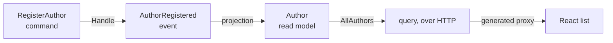

import { Steps, Aside, Tabs, TabItem } from '@astrojs/starlight/components';
import FullStackTabs from '@components/FullStackTabs.astro';

Every app starts with one feature. Ours is **registering an author** — the first thing a librarian does before they can catalog a single book. It's deliberately small, but building it touches the entire Arc loop: a command that expresses intent, the event it records, a read model a projection builds, the query that serves it, and the React screen that calls both — all of it typed end to end.

In a layered app these would be files scattered across `Commands/`, `Handlers/`, `Events/`, and `ReadModels/`, and you'd jump between folders to follow one behavior. Arc organizes by **feature**: everything below lives in one `Features/Authors/` folder you read top to bottom. Here's the slice we're about to build:



## The backend half

<Steps>

1. **Give the domain strong types.** Never thread raw `Guid`s and `string`s through your domain — wrap them so the compiler keeps them straight and your signatures document themselves:

   ```csharp
   public record AuthorId(Guid Value) : ConceptAs<Guid>(Value)
   {
       public static AuthorId New() => new(Guid.NewGuid());
       public static implicit operator EventSourceId(AuthorId id) => new(id.Value.ToString());
   }

   public record AuthorName(string Value) : ConceptAs<string>(Value)
   {
       public static implicit operator AuthorName(string value) => new(value);
   }
   ```

   That implicit conversion from `AuthorId` to `EventSourceId` is what lets Chronicle use an author's id directly as the key of their event stream — no glue code.

2. **Write the command — with `Handle()` on the record.** A command is a `record` marked `[Command]`. The behavior lives in a `Handle()` method **on the record itself**; there's no separate handler class to hunt for. It returns the event(s) that happened:

   ```csharp
   [Command]
   public record RegisterAuthor(AuthorId Id, AuthorName Name)
   {
       public AuthorRegistered Handle() => new(Name);
   }

   [EventType]
   public record AuthorRegistered(AuthorName Name);
   ```

   The event is an immutable, past-tense fact. `[EventType]` carries **no name argument** — Chronicle uses the type name, `AuthorRegistered`, as its identity.

3. **Declare the read model and let a projection fill it.** State the shape you want to query, mark it `[ReadModel]`, and tell it which event feeds it. A static method exposes the query — return an observable so consumers get live updates:

   ```csharp
   [ReadModel]
   [FromEvent<AuthorRegistered>]
   public record Author([property: Key] AuthorId Id, AuthorName Name)
   {
       public static ISubject<IEnumerable<Author>> AllAuthors(IMongoCollection<Author> collection) =>
           collection.Observe();
   }
   ```

   <Aside type="tip" title="Notice what you didn't write">
   There's no update code. **AutoMap** matches `AuthorRegistered.Name` straight onto `Author.Name`, so the projection populates the read model on its own. And that static `AllAuthors` method *is* your query — Arc serves it over HTTP automatically. No controller, no routing, no DTO.
   </Aside>

4. **Build.**

   ```bash
   dotnet build
   ```

   Building compiles your C#, wires `RegisterAuthor` to append through Chronicle when it runs, and — the part that matters most for the next half — **generates TypeScript proxies** for `RegisterAuthor` and `AllAuthors`. Your frontend is about to call them as if they were local, typed code.

</Steps>

## The frontend half

The proxies now exist, generated *from your C#*. Normally this is exactly where type safety ends — you'd hand-write a `fetch`, redeclare the shapes in TypeScript, and hope the two stay in sync. We skip all of it.

<Steps>

1. **Read the authors with the query proxy.** Because `AllAuthors` is an **observable** query, the `.use()` hook re-renders whenever the read model changes — live, no polling:

   ```tsx title="Authors.tsx"
   import { AllAuthors } from './Authors/Author';   // generated proxy

   export const Authors = () => {
       const [authors] = AllAuthors.use();
       return (
           <ul>
               {authors.data.map(a => <li key={String(a.id)}>{a.name}</li>)}
           </ul>
       );
   };
   ```

2. **Register one with the command proxy.** `CommandDialog` runs a generated command — it instantiates it, renders the form fields and the confirm/cancel buttons, and disables confirm while it executes:

   ```tsx title="AddAuthor.tsx"
   import { CommandDialog } from '@cratis/components/CommandDialog';
   import { InputTextField } from '@cratis/components/CommandForm';
   import { RegisterAuthor } from './Authors/RegisterAuthor';   // generated proxy

   export const AddAuthor = () => (
       <CommandDialog<RegisterAuthor> command={RegisterAuthor} title="Add author" okLabel="Add">
           <InputTextField<RegisterAuthor> value={i => i.name} title="Name" />
       </CommandDialog>
   );
   ```

</Steps>

Run the app, register an author, and the list updates the moment you confirm — you didn't write a line of refresh logic. `AllAuthors.use()` is subscribed to the read model, so when the command appends its event and the projection updates, the screen re-renders itself.

## Where the type safety lives

Look at the accessor `i => i.name`. It isn't a string you typed and hope matches — it's a property on the generated `RegisterAuthor` type. Rename `Name` in the C# command, rebuild, and `i => i.name` stops compiling until you fix it. The whole feature is one thing expressed in two languages, and the build is what keeps them honest:

<FullStackTabs>
  <Fragment slot="csharp">
  ```csharp
  [Command]
  public record RegisterAuthor(AuthorId Id, AuthorName Name)
  {
      public AuthorRegistered Handle() => new(Name);
  }
  ```
  </Fragment>
  <Fragment slot="typescript">
  ```tsx
  // generated from the C# above — call it, don't redeclare it
  <CommandDialog<RegisterAuthor> command={RegisterAuthor} title="Add author">
      <InputTextField<RegisterAuthor> value={i => i.name} title="Name" />
  </CommandDialog>
  ```
  </Fragment>
</FullStackTabs>

## What you built

In one folder, read top to bottom:

- a `[Command]` with `Handle()` — intent and implementation together, no handler class,
- the `[EventType]` it records — the permanent fact,
- a `[ReadModel]` a projection fills with no update code, and whose query method is served over HTTP,
- and a **React screen** that reads and writes it through generated, typed proxies.

That's a complete vertical slice, backend to browser. The next feature will be another folder just like it.

There's one problem, though: right now a librarian can register an author with a blank name, or the same author twice, and nothing stops them. A real app has to say no. [Let's make it trustworthy →](./validation)
