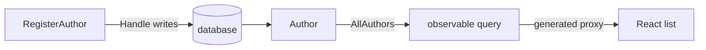

import { Steps, Aside, Tabs, TabItem } from '@astrojs/starlight/components';
import FullStackTabs from '@components/FullStackTabs.astro';

Every app starts with one feature. Ours is **registering an author** — the first thing a librarian does before cataloging a book. You have a command that writes and a query that reads; now let's connect them to a screen without a hand-written API client.

## Prerequisites

Complete [standalone ASP.NET Core setup](/arc/backend/getting-started/) and [Your first command and query](/arc/backend/getting-started/your-first-command/) first. Those pages supply the packages, global imports, `Library.Authors` namespace, database configuration/schema, and Debug proxy output. Choose **MongoDB or EF Core** consistently; neither requires Chronicle.

The setup below adds Vite in the same `Library/` project root; keep components under `src/` and generated files in `src/Authors/`. Do not duplicate the backend types you already created. This tutorial uses the **optional Components dialog UI**; the [Arc-only frontend checkpoint](/arc/frontend/getting-started/) uses ordinary HTML instead. With our source-file proxy grouping, import its `AllAuthors` from `./Authors/Author`, not `./Authors/AllAuthors`.

## Follow the backend half

Arc doesn't force a folder layout. Here the author behavior stays together in `src/Authors/`: strong domain values (`AuthorId`, `AuthorName`), a command, and a read model with a query. Those files use `ConceptAs<Guid>` and `ConceptAs<string>` so the C# compiler distinguishes domain values while the generated client retains their underlying types.


```mermaid
flowchart LR
    Cmd[RegisterAuthor] -->|Handle writes| DB[(database)]
    DB --> RM[Author]
    RM -->|AllAuthors| Q[observable query]
    Q -->|generated proxy| UI[React list]
```

These are **excerpts from the backend checkpoint**, not additional files:

<Tabs syncKey="db">
<TabItem label="MongoDB" icon="seti:db">
```csharp
[Command]
public record RegisterAuthor(AuthorId Id, AuthorName Name)
{
    public Task Handle(IMongoCollection<Author> authors) =>
        authors.InsertOneAsync(new Author(Id, Name));
}

[ReadModel]
public record Author(AuthorId Id, AuthorName Name)
{
    public static ISubject<IEnumerable<Author>> AllAuthors(IMongoCollection<Author> authors) =>
        authors.Observe();
}
```
</TabItem>
<TabItem label="EF Core" icon="seti:db">
```csharp
[Command]
public record RegisterAuthor(AuthorId Id, AuthorName Name)
{
    public async Task Handle(LibraryDbContext db)
    {
        db.Authors.Add(new Author(Id, Name));
        await db.SaveChangesAsync();
    }
}

[ReadModel]
public record Author(AuthorId Id, AuthorName Name)
{
    public static ISubject<IEnumerable<Author>> AllAuthors(LibraryDbContext db) =>
        db.Authors.Observe();
}
```
</TabItem>
</Tabs>

The dependencies are **method-injected**. Returning `Task` adds no payload: the explicit database write is the outcome. The static `AllAuthors` method is the query; no controller or duplicated transport model is needed.

<Aside type="note" title="Live means a configured observation source">
MongoDB requires change streams on a replica set. EF Core receives same-host `SaveChanges` notifications through the configured interceptor; SQLite does not detect external-process writes. Keep the [storage prerequisites](/arc/backend/getting-started/) in place. An observable return type exposes a stream; it cannot make an unconfigured database emit changes.
</Aside>

## Build before importing

```bash
dotnet build -c Debug
```

With `Cratis.Arc.ProxyGenerator.Build` installed and `CratisProxiesOutputPath` set, a post-build tool reads the assembly and PDB and generates `src/Authors/RegisterAuthor.ts` and `src/Authors/Author.ts`. The latter includes `AllAuthors` in source-file output mode. Building a bare Arc project without generator configuration emits no proxies.

If you customize backend routes, mirror them in the [build-time proxy configuration](/arc/backend/proxy-generation/configuration/). Generated clients do not discover runtime route changes.

## Set up the browser project

If you already have a Vite app, retain its entry/configuration and adapt only the composition below. Otherwise, from `Library/`, initialize it without a Chronicle-enabled template:

```bash
npm init -y
npm install react@^19 react-dom@^19 @cratis/fundamentals@^7.10.3 @cratis/arc @cratis/arc.react \
  @cratis/components@^4 reflect-metadata@0.2.2 tsyringe@4.10.0
npm install --save-dev vite typescript @types/react @types/react-dom
```

Use Node.js supported by your chosen Vite release. Keep `@cratis/arc` and `@cratis/arc.react` on the same version used by your generated proxies, within Components' peer range (`>=20.3.1 <23`). The command installs Components and its required peers; this dialog needs neither a separate UI kit nor the optional `pixi.js` peer used by spatial components. Components is required for this chapter's `CommandDialog`, not for Arc itself. See [Components setup](/components/getting-started/) for other installation options.

Create `tsconfig.json`:

```json
{
  "compilerOptions": {
    "target": "ES2022",
    "module": "ESNext",
    "moduleResolution": "Bundler",
    "jsx": "react-jsx",
    "strict": true,
    "experimentalDecorators": true,
    "emitDecoratorMetadata": true,
    "esModuleInterop": true,
    "skipLibCheck": true,
    "noEmit": true,
    "lib": ["ES2022", "DOM"]
  },
  "include": ["src"]
}
```

Create `index.html` at the project root:

```html
<!doctype html>
<html lang="en">
  <head><meta charset="UTF-8"><title>Library</title></head>
  <body><div id="root"></div><script type="module" src="/src/main.tsx"></script></body>
</html>
```

Create `vite.config.ts`:

```typescript
import { defineConfig } from 'vite';

export default defineConfig({
    server: {
        host: 'localhost',
        port: 5173,
        strictPort: true,
        proxy: {
            '/api': { target: 'http://localhost:5000' },
            '/.cratis': { target: 'http://localhost:5000', ws: true }
        }
    }
});
```

The proxy sends same-origin command/query and identity/stream requests to the backend. `ws: true` also permits the optional WebSocket transport. Keep both prefixes, even when using the default SSE transport.

## Read and write from React

<Steps>

1. **Read authors with the query proxy.** Create `src/Authors.tsx`:

   ```tsx
   import { AllAuthors } from './Authors/Author';

   export const Authors = () => {
       const [authors] = AllAuthors.use();
       return (
           <ul>
               {authors.data.map(a => <li key={String(a.id)}>{a.name}</li>)}
           </ul>
       );
   };
   ```

   The hook subscribes to the observable query and re-renders on each new result. String conversion is only for React's key; retain the generated `Guid` when passing ids to commands and queries.

2. **Add the command dialog.** Create `src/AddAuthor.tsx`:

   ```tsx
   import { useState } from 'react';
   import { Guid } from '@cratis/fundamentals';
   import { CommandDialog } from '@cratis/components/CommandDialog';
   import { InputTextField } from '@cratis/components/CommandForm';
   import { RegisterAuthor } from './Authors/RegisterAuthor';

   export const AddAuthor = () => {
       const [id] = useState(() => Guid.create());
       return (
           <CommandDialog<RegisterAuthor>
               command={RegisterAuthor}
               title="Add author"
               okLabel="Add"
               initialValues={{ id }}>
               <InputTextField<RegisterAuthor> value={i => i.name} title="Name" />
           </CommandDialog>
       );
   };
   ```

   Open this through the composition below: **mount a new instance per operation and unmount on close**. The id remains stable while editing and is fresh next time. It is required, so it belongs in `initialValues`, not `onBeforeExecute` (which runs too late to enable confirmation).

</Steps>

## Mount the screen and verify the round trip

Create `src/App.tsx`:

```tsx
import { Arc } from '@cratis/arc.react';
import { useDialog } from '@cratis/arc.react/dialogs';
import { CratisComponentsProvider } from '@cratis/components';
import { AddAuthor } from './AddAuthor';
import { Authors } from './Authors';

function Library() {
    const [AddAuthorDialog, showAddAuthor] = useDialog(AddAuthor);
    return (
        <>
            <button onClick={() => void showAddAuthor()}>Add author</button>
            <Authors />
            <AddAuthorDialog />
        </>
    );
}

export const App = () => (
    <Arc>
        <CratisComponentsProvider>
            <Library />
        </CratisComponentsProvider>
    </Arc>
);
```

`useDialog` mounts its content only while open, so each registration gets new id state. `<Arc>` supplies runtime bindings; `CratisComponentsProvider` supplies the UI library context and does not replace it. No generated `Bindings` file is needed.

Create `src/main.tsx` and import Components' styles once, with tokens first:

```tsx
import 'reflect-metadata';
import '@cratis/components/tokens';
import '@cratis/components/styles';
import '@cratis/components/theme';
import { createRoot } from 'react-dom/client';
import { App } from './App';

createRoot(document.getElementById('root')!).render(<App />);
```

`tokens` supplies shared CSS variables, `styles` supplies component structure, and `theme` adds the baseline appearance, including dark mode. You can omit `theme` when a product design system supplies its own token values.

Keep the backend running on port 5000. From another terminal in `Library/`, run:

```bash
npx tsc --noEmit
npx vite build
npx vite
```

Open `http://localhost:5173`. The first two commands check TypeScript and the production bundle; only the following browser checks prove the round trip:

1. Open the author list and add an author with a nonblank name.
2. Confirm that the list displays the saved name without refresh.
3. Open a **new** dialog and add another author. Inspect the query data: the two ids must differ.
4. Reload the browser and confirm both authors remain.

These checks prove a command/query/persistence round trip. A successful build alone proves none of those effects.

## Where type safety lives

The accessor `i => i.name` is a property on the generated command, not a string. This illustrative pair shows the contract:

<FullStackTabs>
  <Fragment slot="csharp">
  ```csharp
  [Command]
  public record RegisterAuthor(AuthorId Id, AuthorName Name)
  {
      public Task Handle(IMongoCollection<Author> authors) =>
          authors.InsertOneAsync(new Author(Id, Name));
  }
  ```
  </Fragment>
  <Fragment slot="typescript">
  ```tsx
  // Inside AddAuthor; id is the per-operation state declared above.
  <CommandDialog<RegisterAuthor> command={RegisterAuthor} title="Add author" initialValues={{ id }}>
      <InputTextField<RegisterAuthor> value={i => i.name} title="Name" />
  </CommandDialog>
  ```
  </Fragment>
</FullStackTabs>

Rename `Name` in C#, regenerate, then run the frontend type-check. The old accessor fails compilation. Never repair this by editing generated code.

## What you built

One feature now has an explicit write, a live read, and typed React callers — all over current-state storage. There's still a problem: blank and duplicate names are accepted. [Let's make it trustworthy →](/arc/tutorial/validation/)
