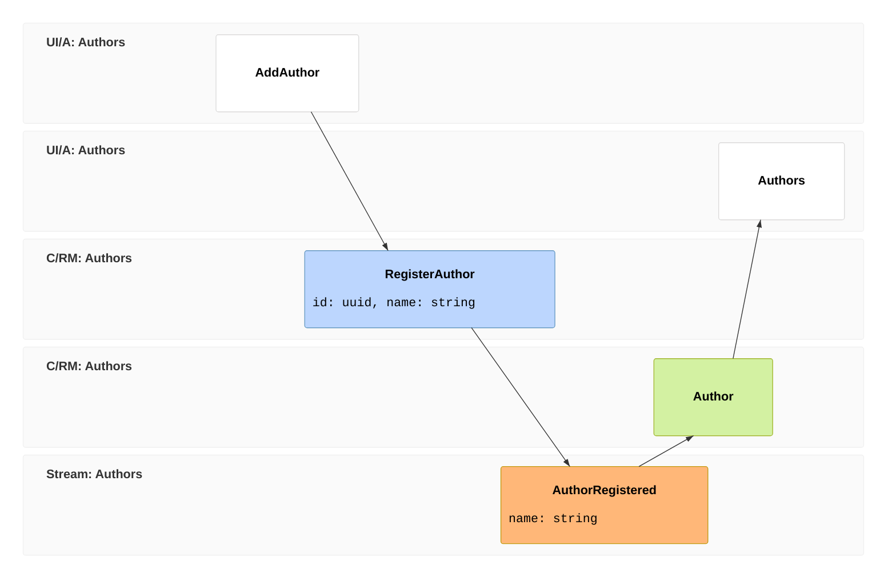
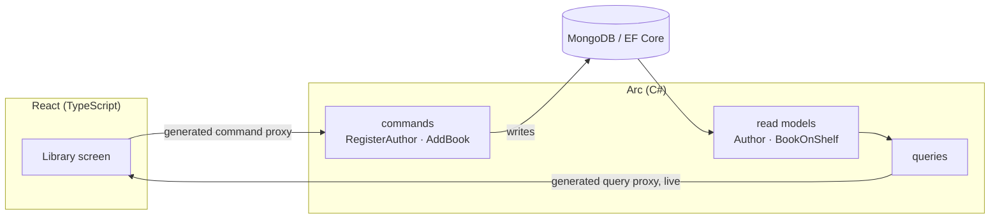

Let's build something real together: the back office for a small library. Librarians register authors, catalog the books each author wrote, and watch the catalog fill in live as they work. It's a modest app — but by the time it's done you'll have used every part of Arc that a real full-stack feature needs, and you'll understand *why* each part is shaped the way it is.

This isn't a tour of one slice in isolation. We'll build several features that lean on each other, the way a real app does — and at each step we'll stop, look at what just happened, and only then move on. The thing Arc is really selling is that the whole loop — a C# command, the read model it updates, the query that serves it, and the React screen that calls both — stays **type-safe end to end**, with no hand-written API client in the middle. You'll feel that pay off repeatedly.

Arc doesn't care where your data lives. We'll store it straight in a database — **MongoDB or EF Core**, your choice — with no event store in sight. If a future slice needs history, auditability, or replay, Chronicle can be added through Arc's optional integration; it is not part of the path we'll build here.

Here's the shape of what we're heading toward, as an **[event model](/event-modeling/)** — the way you'd whiteboard a feature *before* deciding how to store it. Read it left to right: the librarian adds an author on a screen, the `RegisterAuthor` command records the business fact that an author was registered, the `Author` read model is updated, and the next screen lists it. Don't worry if the pieces aren't familiar yet — we'll meet each one in turn.

`AuthorRegistered` is the business **fact** in the model; it is not a storage decision. Over a plain database your command writes the `Author` read model directly. Each later feature (add books, list them) is another column of the same shape.

That's *what* you'll build. Here's *how* Arc runs it — and the part that earns its place: you write the command and the query once in C#, and the build **generates the typed proxies** your React calls, so the frontend can't drift from the backend. Over a database the path is direct:

The two diagrams are two views of the same feature: the event model is the **domain flow** you design, and the flowchart is the **typed boundary** the build wires up for you — generated C# → TypeScript proxies, no hand-written API client. That boundary is the heart of Arc; [Understanding the proxy boundary](/arc/understanding-the-proxy-boundary/) goes deeper on it.

## What you'll build

By the last chapter you'll have a working library back office where a librarian can:

- **register an author** and see the list update the instant they confirm — no refresh,
- be **stopped from registering a blank or duplicate name**, with the reason shown right on the form,
- **add books** to an author and browse them,
- and do all of this behind **role-based authorization**, so only a librarian can change the catalog.

## What you'll learn

- The full Arc loop — **command → read model → query → React** — and how `dotnet build` keeps the two languages in sync.
- How to put **validation and business rules** on a command and have the failure surface in the UI through the generated proxy.
- How to model a **second feature that reads the first**, and read related data back.
- How **observable queries** keep a screen live with no polling.
- How to **authorize** commands and queries at the boundary.

## What you'll need

An Arc project running locally with a database. The [Get started](/arc/backend/getting-started/your-first-command/) guide gets you there: scaffold with `dotnet new cratis`, start the dependencies, and confirm `dotnet build` succeeds and the app runs. We use **MongoDB** for the worked examples and show the **EF Core** equivalent in tabs as we go — pick whichever you scaffolded with.

## The tour

1. **[Your first full-stack slice](./first-slice)** — register an author from C# all the way to a live React screen, fully typed.
2. **[Make it trustworthy](./validation)** — reject bad input with a validator and a uniqueness rule, and show the reason in the form.
3. **[Relate your slices](./books-and-relationships)** — add books that belong to an author, and read them back.
4. **[Make it live](./real-time)** — observable queries that update the screen the moment the data changes.
5. **[Decide who can do what](./authorization)** — lock the catalog down with role-based authorization.

Each chapter ends where the next begins. By the end you'll have a real full-stack feature — and the model to build your own. Ready? [Let's build the first slice →](./first-slice)
