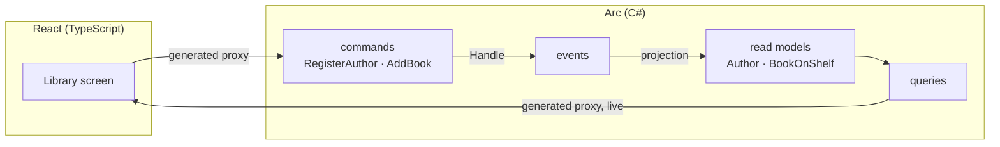

Let's build something real together: the back office for a small library. Librarians register authors, catalog the books each author wrote, and watch the catalog fill in live as they work. It's a modest app — but by the time it's done you'll have used every part of Arc that a real full-stack feature needs, and you'll understand *why* each part is shaped the way it is.

This isn't a tour of one slice in isolation. We'll build several features that lean on each other, the way a real app does — and at each step we'll stop, look at what just happened, and only then move on. The thing Arc is really selling is that the whole loop — a C# command, the event it records, the read model a projection builds, the query that serves it, and the React screen that calls it — stays **type-safe end to end**, with no hand-written API client in the middle. You'll feel that pay off repeatedly.

Here's the shape of what we're heading toward. Don't worry if the pieces aren't familiar yet — we'll meet each one in turn:

## What you'll build

By the last chapter you'll have a working library back office where a librarian can:

- **register an author** and see the list update the instant they confirm — no refresh,
- be **stopped from registering a blank or duplicate name**, with the reason shown right on the form,
- **add books** to an author and browse them,
- and do all of this behind **role-based authorization**, so only a librarian can change the catalog.

## What you'll learn

- The full Arc loop — **command → event → projection → query → React** — and how `dotnet build` keeps the two languages in sync.
- How to put **validation and business rules** on a command and have the failure surface in the UI for free.
- How to model a **second feature that reads the first**, with projections that fold events into queryable state.
- How **observable queries** keep a screen live, and how a **reactor** automates a side effect.
- How to **authorize** commands and queries at the boundary.

## What you'll need

An Arc project running locally. The [Get started](/arc/backend/getting-started/your-first-command/) guide gets you there: scaffold with `dotnet new cratis`, start the dependencies, and confirm `dotnet build` succeeds and the app runs. Come back when it does — we'll build the library on top of it.

If you've never worked with an event-sourced backend before, you don't need to stop and learn Chronicle first; we'll explain what you need as we go. But the [Chronicle tutorial](/chronicle/tutorial/) is a gentle companion if you want the event-sourcing side in more depth.

## The tour

1. **[Your first full-stack slice](./first-slice)** — register an author from C# all the way to a React screen, fully typed.
2. **[Make it trustworthy](./validation)** — reject bad input with a validator and a uniqueness rule, and show the reason in the form.
3. **[Relate your slices](./books-and-relationships)** — add books that belong to an author, and read them back.
4. **[Make it live, make it react](./real-time)** — observable queries that update the screen live, and a reactor that automates a follow-up.
5. **[Decide who can do what](./authorization)** — lock the catalog down with role-based authorization, then look back at everything you built.

Each chapter ends where the next begins. By the end you'll have a real full-stack feature — and the model to build your own. Ready? [Let's build the first slice →](./first-slice)
