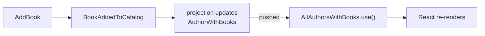

import { Steps, Aside } from '@astrojs/starlight/components';

We keep saying the catalog "stays live." This chapter makes that concrete, and then adds the other half of automation: doing something — not just *showing* something — when an event happens.

## Why the screen already moves

Go back to every query we've written: each returns `collection.Observe()`, not a one-shot list. That `ISubject<…>` is a stream. On the C# side, Arc serves it as an observable query; on the React side, the generated `.use()` hook **subscribes** to it. So the data flow isn't "fetch once and render" — it's a standing subscription:



When a command appends an event, the projection updates the read model, and every subscribed query pushes the new value to its React component, which re-renders. Open the app in two browser tabs, add a book in one, and watch it appear in the other — you wrote none of that plumbing. It falls out of returning `Observe()` and calling `.use()`.

<Aside type="note" title="Under the hood">
The subscription rides Server-Sent Events: the browser holds an open connection and Arc pushes each new value down it. You don't manage the connection, and you don't poll. If you ever want to watch the raw stream, you can — see [observable queries with cURL](/arc/backend/queries/using-observable-queries-with-curl/).
</Aside>

That covers *reading* reactively. But sometimes an event should trigger an **action** — send a notification, call another system, kick off a follow-up command. Displaying it on a screen isn't enough. That's what a reactor is for.

## A reactor: do something when a book arrives

Say that whenever a book is added to the catalog, we want to announce it on the library's "new arrivals" feed. That's a side effect, not a read model — so it's a reactor, not a projection.

A reactor is a plain class implementing the marker interface `IReactor`. There's nothing to override: Arc dispatches to a method by the **type of its first parameter**. Add an event type, get called when it happens.

<Steps>

1. **React to the event.** Inject whatever collaborator does the work, and handle the event:

   ```csharp
   public class NewArrivalsAnnouncer(INewArrivalsFeed feed) : IReactor
   {
       public async Task BookAdded(BookAddedToCatalog @event, EventContext context) =>
           await feed.Announce($"New on the shelf: {@event.Title}");
   }
   ```

   The method name is just for you — Arc routes by the `BookAddedToCatalog` parameter type. The `EventContext` is there if you need metadata like the event source id; drop it if you don't.

</Steps>

<Aside type="caution" title="Three rules that keep reactors honest">
- **Be idempotent.** A reactor can be called more than once for the same event — during replay or recovery. Make "announce this book" safe to run twice.
- **Use the event's data directly.** Everything you need is on `@event`. Don't query a read model back inside a reactor; it may not have caught up yet.
- **To write new events, send a command.** If a reaction needs to change state, inject `ICommandPipeline` and `Execute` a command — never reach for the event log from a reactor.
</Aside>

## Reacting by commanding

That last rule is the bridge between slices. When a reaction's job is to *cause* something — not just to call out to the world — it executes a command, and that command runs its own validation and `Handle()` like any other:

```csharp
public class CatalogIndexer(ICommandPipeline commands) : IReactor
{
    public Task BookAdded(BookAddedToCatalog @event, EventContext context) =>
        commands.Execute(new IndexBookForSearch(@event.BookId, @event.Title));
}
```

This is how one feature triggers another without the two slices knowing about each other's internals — they meet only at the event. The book slice doesn't import the search slice; it just records that a book was added, and the search slice decides to care.

## What you built

- A clear picture of **why your screens update themselves** — observable queries are standing subscriptions, end to end.
- A **reactor** that runs an automatic side effect when an event happens, dispatched by event type with no registration.
- The pattern for a reaction that **changes state** — execute a command through `ICommandPipeline`, never the event log.

The catalog is live and it reacts. There's just one thing left before it's a real back office: right now *anyone* can register authors and add books. Let's decide who's allowed. [Lock it down →](./authorization)
