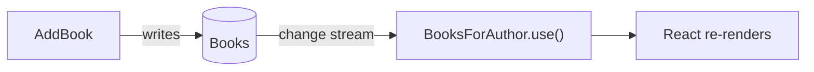

import { Aside } from '@astrojs/starlight/components';

We keep saying the catalog "stays live." This chapter makes that concrete — and shows that you already built it, without writing a line of real-time plumbing.

## Why the screen already moves

Go back to every query we've written: each returns `…Observe(…)`, not a one-shot list. That `ISubject<…>` is a stream. On the C# side, Arc serves it as an observable query; on the React side, the generated `.use()` hook **subscribes** to it. So the data flow isn't "fetch once and render" — it's a standing subscription:



When a command writes, the database's change stream notices, the observable query pushes the new value to every subscribed React component, and it re-renders. Open the app in two browser tabs, add a book in one, and watch it appear in the other — you wrote none of that plumbing. It falls out of returning `Observe()` and calling `.use()`.

<Aside type="note" title="Under the hood">
The subscription rides Server-Sent Events: the browser holds an open connection and Arc pushes each new value down it. You don't manage the connection, and you don't poll. On the backend, the live signal comes from the database itself — MongoDB's [change streams](/arc/backend/mongodb/observing-collections/) or an [observed `DbSet`](/arc/backend/entity-framework/observing/) watching for changes. If you ever want to watch the raw stream, you can — see [observable queries with cURL](/arc/backend/queries/using-observable-queries-with-curl/).
</Aside>

## What makes a query live

Nothing special — just the return type. A one-shot query returns the data:

```csharp
public static IEnumerable<Author> AllAuthors(IMongoCollection<Author> authors) =>
    authors.Find(_ => true).ToList();
```

Make it return an `ISubject<…>` via `Observe()` instead, and the exact same method becomes a live subscription — the proxy and the React `.use()` adapt automatically:

```csharp
public static ISubject<IEnumerable<Author>> AllAuthors(IMongoCollection<Author> authors) =>
    authors.Observe();
```

That's the whole switch between "load once" and "stay live." You choose per query: a rarely-changing lookup can be a plain list; a screen the librarian watches should observe.

## What you built

- A clear picture of **why your screens update themselves** — observable queries are standing subscriptions, database to browser.
- The one-line difference between a **one-shot** query and a **live** one — the return type, nothing else.

The catalog is live. There's just one thing left before it's a real back office: right now *anyone* can register authors and add books. Let's decide who's allowed. [Lock it down →](./authorization)
