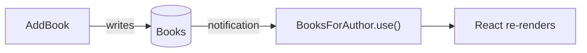

import { Aside } from '@astrojs/starlight/components';

We keep saying the catalog "stays live." This chapter makes that concrete — and shows that you already built it, without writing a line of real-time plumbing.

## Why the screen already moves

Go back to every query we've written: each returns `…Observe(…)`, not a one-shot list. That `ISubject<…>` is a stream. On the C# side, Arc serves it as an observable query; on the React side, the generated `.use()` hook **subscribes** to it. So the data flow isn't "fetch once and render" — it's a standing subscription:


```mermaid
flowchart LR
    AddBook -->|writes| Books[(Books)]
    Books -->|notification| Query["BooksForAuthor.use()"]
    Query --> React["React re-renders"]
```

When a command writes and the configured observation source notifies, the observable query publishes updated data to subscribed React components, which re-render. Open the app in two browser tabs, add a book in one, and watch it appear in the other — you wrote none of that plumbing. It falls out of returning `Observe()` and calling `.use()`.

<Aside type="note" title="Under the hood">
The subscription rides Server-Sent Events: the browser holds an open connection and Arc pushes each new value down it. You don't manage the connection, and you don't poll. On the backend, MongoDB uses [change streams](/arc/backend/mongodb/observing-collections/) on a replica set or supported sharded deployment. An [observed `DbSet`](/arc/backend/entity-framework/observing/) receives in-process notifications from the configured `SaveChanges` interceptor. SQLite relies on that path only; SQL Server/PostgreSQL cross-process detection requires their database notification setup. If database notification setup fails, EF observation can fall back to in-process-only behavior; inspect server logs rather than assuming external writes are visible. If you ever want to watch the raw stream, you can — see [observable queries with cURL](/arc/backend/queries/using-observable-queries-with-curl/).
</Aside>

## Verify the scope of observation

Continue from [chapter 3](/arc/tutorial/books-and-relationships/). Open two browser tabs connected to the **same backend process**. Subscribe to the same author's catalog in both; add a book in one and verify the other updates without reload. This tests the tutorial's live path, including SQLite. It does not prove cross-process observation.

External writes are a separate test: MongoDB change streams can report them when configured; SQLite cannot. For EF's other providers, configure their database notification mechanism before testing a write from a second process. No notification source means an observable endpoint can stay connected without fresh data.

## What makes a query live

The following are **alternative MongoDB method fragments** in `Author`, using the tutorial imports. Replace the method rather than adding a second method with the same signature.

Nothing special — just the return type. A one-shot query returns the data:

```csharp
public static IEnumerable<Author> AllAuthors(IMongoCollection<Author> authors) =>
    authors.Find(_ => true).ToList();
```

Make it return an `ISubject<…>` via `Observe()` instead, and the exact same method becomes a live subscription — the proxy and the React `.use()` adapt automatically:

```csharp
public static ISubject<IEnumerable<Author>> AllAuthors(IMongoCollection<Author> authors) =>
    authors.Observe();
```

That's the whole switch between "load once" and "stay live." You choose per query: a rarely-changing lookup can be a plain list; a screen the librarian watches should observe.

## What you built

- A clear picture of **why your screens update themselves** — observable queries are standing subscriptions, database to browser.
- The method-level difference between a **one-shot** query and a **live** one — the return type and observation call, with a configured notification source underneath.

The catalog is live. There's just one thing left before it's a real back office: right now *anyone* can register authors and add books. Let's decide who's allowed. [Lock it down →](/arc/tutorial/authorization/)
