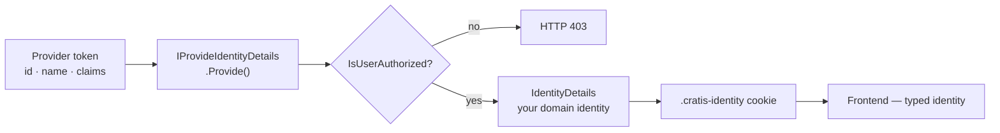

import { Aside } from '@astrojs/starlight/components';

Three questions run through every real application: **who is this user**, **what are they allowed to do**, and — if you serve more than one customer — **whose data are they allowed to see**. Arc answers all three at the boundary, so your command and query code stays about the domain, not about access checks. This page is the mental model; each section links to the reference that goes deeper.

## Who is the user — identity, enriched once

A token from your identity provider (Entra ID, Auth0, whatever) knows the basics — an id, a name, some claims. It does *not* know that this user is a *Librarian* who may edit the catalog. That domain knowledge lives in your system, and Arc gives you one place to add it.

You implement `IProvideIdentityDetails<TDetails>`. Arc calls it at ingress with the provider's token, you enrich it with whatever your domain needs, and you say whether the user is allowed in at all:

```csharp
public class LibraryIdentityProvider(IMongoCollection<Member> members)
    : IProvideIdentityDetails<LibraryIdentity>
{
    public async Task<IdentityDetails> Provide(IdentityProviderContext context)
    {
        // Look the user up in your own data, keyed by the provider's id.
        var member = await members.Find(m => m.Subject == context.Id.Value).FirstOrDefaultAsync();
        if (member is null)
            return new IdentityDetails(false, LibraryIdentity.None);   // not authorized → 403

        var identity = new LibraryIdentity(member.Id, member.Role, member.Name);
        return new IdentityDetails(true, identity);
    }
}
```



Two things fall out of this for free:

- **Authorization at the front door.** Returning `IsUserAuthorized: false` stops an unwanted user before a single command runs — Arc returns `403` and they never reach your app.
- **One identity, backend to browser.** The details you return are published as a `.cratis-identity` cookie and consumed, typed, on the React side — the same way commands and queries are. You enrich identity once and read it everywhere. (Details: [Identity](/arc/backend/identity/), [contracts](/arc/backend/identity/contracts/), and [on the frontend](/arc/frontend/react/identity/).)

<Aside type="tip" title="This is where 'blocked', 'trial expired', and 'which tenant' belong">
Anything you compute about the user up front — their role, whether they're blocked, their tenant, their feature flags — belongs in the details payload. Compute it once here instead of re-deriving it in every handler.
</Aside>

## What can they do — authorize commands and queries

Once you know who the user is, you gate *what they can do* with attributes, right on the command or query — no checks scattered through your logic:

```csharp
[Roles("Librarian")]                       // only a Librarian may register an author
[Command]
public record RegisterAuthor(AuthorId Id, AuthorName Name)
{
    public AuthorRegistered Handle() => new(Name);
}

[ReadModel]
public record Author(AuthorId Id, AuthorName Name)
{
    [AllowAnonymous]                        // the public catalog is open to everyone
    public static ISubject<IEnumerable<Author>> AllAuthors(IMongoCollection<Author> c) => c.Observe();
}
```

- `[Authorize]` requires an authenticated user; `[Roles("Librarian", "Admin")]` requires **at least one** of the listed roles; `[AllowAnonymous]` opens a specific endpoint back up.
- Apply them at the **class level** to cover everything and **override per method** for exceptions — secure by default, opt out where you mean it.
- A failure is automatic: `401` if they're not signed in, `403` if they are but lack the role. The frontend's [generated proxy](/arc/understanding-the-proxy-boundary/) surfaces it in the command result, so the UI can react.

When a rule is about *this specific row* — "you can only edit your own profile" — that's not an attribute, it's a check inside `Handle()` against the current user. (Full matrix, claims access, and inheritance rules: [Authorization](/arc/backend/core/authorization/).)

## Whose data — multi-tenancy

If one deployment serves many customers, *who* and *what* aren't enough — you need *whose*. Arc treats the **tenant** as a first-class part of every request: it resolves a tenant id, keeps it in context for the whole request, and points tenant-aware stores at the right data.

The shape of it:

1. A **resolver** establishes the tenant for each request — from a claim, a header, a subdomain — *after* authentication, so a user can't ask for a tenant they don't belong to.
2. The tenant id is available everywhere through **tenant context**, so you never thread it by hand.
3. **Tenant-aware data stores** (a database per tenant, or a partition) keep one customer's events and read models physically apart from another's — isolation by construction, not by remembering to add a `WHERE tenantId =` to every query.

<Aside type="caution" title="Resolve the tenant after you authenticate">
Tenant id is sensitive. Resolve it from authenticated claims, validate membership, and never trust a raw header or query parameter — otherwise tenant isolation is one spoofed value away from breaking.
</Aside>

Set it up with [tenant resolvers](/arc/backend/tenancy/resolvers/), reach it through [tenant context](/arc/backend/tenancy/tenant-context/), and isolate storage with [database resolvers](/arc/backend/tenancy/database-resolvers/) — the [tenancy overview](/arc/backend/tenancy/overview/) ties them together.

## Where to go next

- [Identity](/arc/backend/identity/) — the provider flow, contracts, and multi-service topologies in full.
- [Authorization](/arc/backend/core/authorization/) — every attribute, the inheritance rules, and claims-based custom logic.
- [Tenancy](/arc/backend/tenancy/overview/) — resolvers, context, and per-tenant data isolation.
- [Microsoft Identity](/arc/backend/asp-net-core/microsoft-identity/) — wiring Entra ID / Azure AD as your provider.
