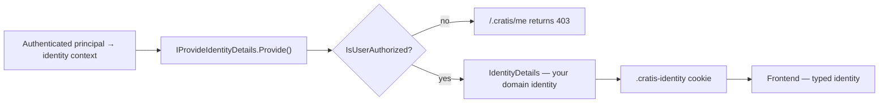

import { Aside } from '@astrojs/starlight/components';

Three questions run through every real application: **who is this user**, **what are they allowed to do**, and — if you serve more than one customer — **whose data are they allowed to see**. Arc supplies hooks for all three, but authentication, operation authorization, tenant membership, and storage isolation remain distinct responsibilities. This page is the mental model; each section links to the reference that goes deeper.

## Who is the user — identity, enriched once

Authentication establishes a `ClaimsPrincipal` — an id, a name, and claims, including any authorization roles. Your application may also need display preferences, membership information, or other domain details. Arc lets you enrich that identity without confusing the details with authoritative role claims.

Implement `IProvideIdentityDetails<TDetails>`. During identity resolution, Arc calls it with an `IdentityProviderContext`, **not the raw token**. This illustrative MongoDB fragment assumes application-owned `Member` and `LibraryIdentity` types and the identity/provider imports; it controls the identity-details result, not access to every command:

```csharp
public class LibraryIdentityProvider(IMongoCollection<Member> members)
    : IProvideIdentityDetails<LibraryIdentity>
{
    public async Task<IdentityDetails> Provide(IdentityProviderContext context)
    {
        // Look the user up in your own data, keyed by the provider's id.
        var member = await members.Find(m => m.Subject == context.Id.Value).FirstOrDefaultAsync();
        if (member is null)
            return new IdentityDetails(false, LibraryIdentity.None);   // /.cratis/me rejects this result

        var identity = new LibraryIdentity(member.Id, member.Role, member.Name);
        return new IdentityDetails(true, identity);
    }
}
```


```mermaid
flowchart LR
    T["Authenticated principal → identity context"] --> P["IProvideIdentityDetails.Provide()"]
    P --> Q{IsUserAuthorized?}
    Q -- no --> F["/.cratis/me returns 403"]
    Q -- yes --> D["IdentityDetails — your domain identity"]
    D --> C[".cratis-identity cookie"]
    C --> UI["Frontend — typed identity"]
```

Two things fall out of this design:

- **Identity-details rejection.** `IsUserAuthorized: false` makes `/.cratis/me` return `403` for that result. It is **not a global operation gate**: the command/query authorization evaluator checks the principal and operation attributes independently. Protect actual operations against blocked users or expired subscriptions; hiding the UI or rejecting identity enrichment is insufficient.
- **One identity, backend to browser.** The details you return are published as a `.cratis-identity` cookie and consumed, typed, on the React side — the same way commands and queries are. You enrich identity once and read it everywhere. (Details: [Identity](/arc/backend/identity/), [contracts](/arc/backend/identity/contracts/), and [on the frontend](/arc/frontend/react/identity/).)

<Aside type="caution" title="Details are not authorization claims">
A `LibraryIdentity.Role` property is display/domain data; it does not add `ClaimTypes.Role` or grant `[Roles("Librarian")]`. The `.cratis-identity` cookie supplies client context, not authoritative proof of permission. Establish roles in the authenticated principal using trusted authentication/claims configuration. Enforce blocked-user, subscription, and membership restrictions on the server's actual operations as well as reflecting them in the UI.
</Aside>

## What can they do — authorize commands and queries

Gate *what they can do* with attributes on the command or query. This standalone MongoDB excerpt uses the [tutorial's domain types and provider setup](/arc/backend/getting-started/your-first-command/) plus `Cratis.Arc.Authorization` imports:

```csharp
[Roles("Librarian")]                       // only a Librarian may register an author
[Command]
public record RegisterAuthor(AuthorId Id, AuthorName Name)
{
    public Task Handle(IMongoCollection<Author> authors) =>
        authors.InsertOneAsync(new Author(Id, Name));
}

[ReadModel]
public record Author(AuthorId Id, AuthorName Name)
{
    [AllowAnonymous]                        // the public catalog is open to everyone
    public static ISubject<IEnumerable<Author>> AllAuthors(IMongoCollection<Author> c) => c.Observe();
}
```

- `[Authorize]` requires an authenticated user; `[Roles("Librarian", "Admin")]` requires **at least one** of the listed roles; `[AllowAnonymous]` opens a specific endpoint back up.
- Apply them at the **class level** to cover everything and **override per method** for exceptions — secure by default, opt out where you mean it.
- A failure is automatic: `401` if authentication stops the request before Arc runs, `403` if Arc's command or query pipeline rejects the signed-in user. Pipeline authorization failures are surfaced in the generated command/query result as `isAuthorized: false`, so the UI can react.

When a rule depends on a specific row — "you can only edit your own profile" — enforce it server-side against the trusted principal and that row, using your authorization extension or an explicit operation guard. An ordinary validation rejection is not the same result as an authorization rejection. (Full matrix, claims access, and inheritance rules: [Authorization](/arc/backend/core/authorization/).)

## Whose data — multi-tenancy

If one deployment serves many customers, *who* and *what* aren't enough — you need *whose*. Arc treats the **tenant** as a first-class part of every request: it resolves a tenant id, keeps it in context for the whole request, and points tenant-aware stores at the right data.

The shape of it:

1. A **resolver selects a tenant id** from a claim, header, or other configured source. A header resolver simply reads the value; running it after authentication does **not** prove membership.
2. Your trusted ingress or application **authorizes the user's membership** in the selected tenant before serving tenant data. The id is then available through tenant context.
3. Configure and verify **tenant-aware storage** separately — database routing, partitions, or application query filters. Tenant selection alone neither isolates data nor proves every command/query uses the selected store. Test both cross-tenant membership rejection and storage separation.

<Aside type="caution" title="Resolve the tenant after you authenticate">
Tenant id is sensitive. Resolve it from authenticated claims, validate membership, and never trust a raw header or query parameter — otherwise tenant isolation is one spoofed value away from breaking. In production, [Cratis AuthProxy](/authproxy/) can take this on at the edge: it strips spoofable identity and tenant headers from every inbound request, resolves the tenant after the user signs in, and validates it before the request reaches your app.
</Aside>

Set it up with [tenant resolvers](/arc/backend/tenancy/resolvers/), reach it through [tenant context](/arc/backend/tenancy/tenant-context/), and isolate storage with [database resolvers](/arc/backend/tenancy/database-resolvers/) — the [tenancy overview](/arc/backend/tenancy/) ties them together.

## Where to go next

- [Identity](/arc/backend/identity/) — the provider flow, contracts, and multi-service topologies in full.
- [Authorization](/arc/backend/core/authorization/) — every attribute, the inheritance rules, and claims-based custom logic.
- [Tenancy](/arc/backend/tenancy/) — resolvers, context, and per-tenant data isolation.
- [Microsoft Identity headers](/arc/backend/asp-net-core/microsoft-identity/) — accepting the `x-ms-client-principal` family of HTTP headers from your ingress. These are unsigned assertions accepted from a **trusted ingress**, not bearer tokens validated by Arc. The ingress must replace spoofable headers and prevent direct backend access. For local-only fixtures, see [Generate a principal](/arc/general/generating-principal/).
