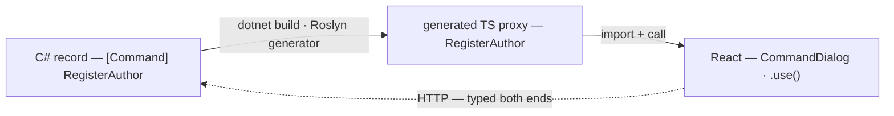

import { Steps, Aside } from '@astrojs/starlight/components';
import FullStackTabs from '@components/FullStackTabs.astro';

Every full-stack app has a seam down the middle: C# on one side, TypeScript on the other, HTTP in between. Normally *you* are the glue across that seam — you write a controller, hand-write a DTO, redeclare its shape in TypeScript, wrap it in a `fetch`, and then spend the rest of the project keeping both sides in agreement. Nothing tells you when they drift: a renamed field compiles happily on each side and fails in the browser at runtime.

Arc removes that seam. You write the command or query **once, in C#**, and the build generates the TypeScript your frontend calls. There's no second declaration to keep in sync, because there's no second declaration at all. This page is about *why that works* and *what keeps it honest* — the idea at the center of everything Cratis calls "full-stack type safety."

## One source of truth

The thing to internalize: **your C# command and query records are the contract.** The TypeScript proxy isn't a parallel definition you maintain — it's a *projection* of the C# types, regenerated on every build. There is exactly one place the shape of `RegisterAuthor` is defined, and it's the C# record.



Because the proxy is generated from the very types Arc uses to bind the incoming HTTP request, the client and the server *can't* disagree about the wire format. The compiler — on **both** sides — is enforcing one contract.

## Walk the boundary

<Steps>

1. **Write the slice in C#.** A command is a record; the behavior lives in `Handle()` on the record. This is the only place the shape is declared:

   ```csharp
   [Command]
   public record RegisterAuthor(AuthorId Id, AuthorName Name)
   {
       public AuthorRegistered Handle() => new(Name);
   }
   ```

2. **Build.** `dotnet build` runs the Arc proxy generator — a Roslyn source generator wired in as an MSBuild step. It reads your compiled assembly, finds every `[Command]`, every `[ReadModel]` query method, and the types and enums they touch, and writes a typed TypeScript proxy for each — mirroring your namespace folders, with an `index.ts` per folder.

3. **Import the proxy in React.** It's already there, generated from the C# above — call it as if it were local, typed code:

   ```tsx
   import { RegisterAuthor } from './Authors/RegisterAuthor';   // generated

   <CommandDialog command={RegisterAuthor} title="Add author">
       <InputTextField<RegisterAuthor> value={i => i.name} title="Name" />
   </CommandDialog>
   ```

</Steps>

## What keeps it honest

Here's the payoff — and the whole reason the boundary is *generated* rather than written. Suppose you rename `Name` to `FullName` on the command:

<FullStackTabs>
  <Fragment slot="csharp">
  ```csharp
  [Command]
  public record RegisterAuthor(AuthorId Id, AuthorName FullName)   // was Name
  {
      public AuthorRegistered Handle() => new(FullName);
  }
  ```
  </Fragment>
  <Fragment slot="typescript">
  ```tsx
  // After `dotnet build`, the generated proxy has `fullName`, not `name`.
  // This line stops compiling until you fix it — caught at build, not in production:
  <InputTextField<RegisterAuthor> value={i => i.name} title="Name" />
  //                                         ^^^^ Property 'name' does not exist on RegisterAuthor
  ```
  </Fragment>
</FullStackTabs>

You didn't run the app. You didn't open the browser. The TypeScript compiler caught the drift the instant the contract changed, because the accessor `i => i.name` points at a property the regenerated type no longer has. That's the difference between a generated boundary and a hand-written one: drift is a **compile error**, not a **production incident**.

<Aside type="note" title="The read side is just as honest">
Rename a field on a `[ReadModel]`, rebuild, and every component reading it through the generated query proxy stops compiling the same way. The contract holds in both directions — commands you send and data you read.
</Aside>

## What gets generated

Each build, Arc emits typed proxies for:

- **Commands** — a class you instantiate and execute (or hand to a `CommandDialog`), with every parameter — route, query string, body — flattened into typed properties.
- **Queries** — a proxy exposing a React `.use()` hook that returns the typed result with its loading and error state; **observable** queries return a live subscription that re-renders on change — no polling, no manual refresh.
- **Types and enums** — every complex type and enum your commands and queries reference, so nested shapes are typed too.
- **Identity details** — your custom identity type, so the signed-in user is typed on the frontend.

Each has a detailed reference: [Commands](/arc/backend/proxy-generation/commands/), [Queries](/arc/backend/proxy-generation/queries/), and [Identity details](/arc/backend/proxy-generation/identity-details/). The [frontend proxy-generation guide](/arc/frontend/react/proxy-generation/) shows the generated TypeScript for each, with the `.use()` and `useSuspense()` hooks.

## The transport disappears too

Types are only half of what the proxy absorbs. The other half is **how the call travels**. Your component never writes a URL, picks an HTTP verb, or opens a socket — it executes `RegisterAuthor` or renders `AllAuthors.use()`, and the proxy owns the wire. That makes the transport an implementation detail behind the boundary: today the calls ride HTTP, and if Arc carried them over something else — gRPC-Web, say — the proxy is where that would change, not your components.

The query system already cashes in on this freedom. A regular query executes as a plain HTTP request. An observable query streams — over WebSockets or Server-Sent Events, a choice you make once with the `queryTransportMethod` prop on the [`<Arc/>` context component](/arc/frontend/react/arc/), not in any component. And the same observable query can still be executed as a one-shot HTTP fetch by calling `perform()` on the proxy, when you want a snapshot instead of a subscription:

```tsx
const [authors] = AllAuthors.use();                  // live — streams over WebSockets or SSE
const snapshot = await new AllAuthors().perform();   // one-shot — a plain HTTP fetch, same proxy
```

One definition in C#, one proxy in TypeScript — and whether the data arrives as a response or a stream is the proxy's concern, not yours. Tune the live transport in the [query configuration reference](/arc/frontend/react/queries/configuration/).

## It's a build step, not a checkout

A few things follow from the proxies being *generated*, and they're worth holding onto:

- **You never edit a generated file.** Treat the generated folder like build output — change the C#, rebuild, and the TypeScript follows.
- **The generator tracks what it made** and removes files for commands or queries you delete, so the generated tree doesn't accumulate ghosts. (See [File index tracking](/arc/backend/proxy-generation/file-index-tracking/).)
- **The sequencing is fixed:** backend compiles → proxies generate → the frontend can reference them. For a single slice you can't build the React half before the C# half compiles — which is exactly why the workflow is backend-first.

## Why this is the thing that matters

Plenty of frameworks give you CQRS, or an event store, or a component library. The proxy boundary is what makes Cratis **full-stack**: the type safety doesn't stop at the edge of the backend — it runs all the way to the React component. It's why a Cratis feature is *one* thing expressed in two languages, kept in agreement by the build instead of by discipline.

Ready to see it run? [Build your first command and query](/arc/backend/getting-started/your-first-command/), then [wire it into React](/arc/frontend/getting-started/) — and watch the same property name flow from C# all the way to the screen.
