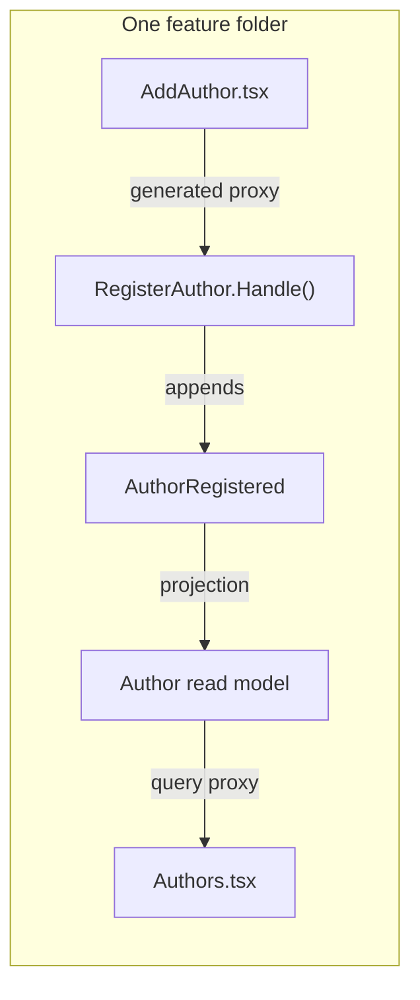

Cratis applications are organized by **feature**, not by technical layer. Everything for one behavior — the command, the events it produces, the projection that builds its read model, the React component that renders it, and the specs that prove it — lives together in a single folder. That folder is a **vertical slice**.

This page explains *why*. If you want to see one built, the [capstone walkthrough](/build-a-full-app/) does exactly that.

## The pain it removes

In a layer-organized codebase, one feature is smeared across the tree:

```
❌ Organized by layer — "register author" touches five folders
Commands/RegisterAuthor.cs
Handlers/RegisterAuthorHandler.cs
Events/AuthorRegistered.cs
ReadModels/AuthorProjection.cs
web/src/features/authors/AddAuthor.tsx
```

To change how authors register, you open five folders, hold the whole layer cake in your head, and hope you didn't miss a place. New contributors have to learn *every* layer before they can touch *one* feature.

A vertical slice puts the whole feature in one place:

```
✅ Organized by feature — one folder, read top to bottom
Features/Authors/Registration/
├── Registration.cs        # command + Handle() + events + projection
├── AddAuthor.tsx          # the React screen
└── when_registering/      # the specs
```

You navigate by *what the software does*, not by *what kind of file it is*.

## Why the frontend and backend belong together

This is the part that surprises people coming from a layered or separate-repo world. Cratis deliberately keeps the C# backend and the React frontend of a feature side by side. Three reasons:

1. **A feature is one thing, and it spans the stack.** "Register an author" is not a backend task and a frontend task — it's *one* behavior with a write side and a read side. The command, the event, and the form are different facets of the same change. They are conceived together, they change together, and a bug usually lives in the seam between them. Keeping them adjacent means one mental context and, often, one pull request.

2. **Full-stack type safety binds them anyway.** Arc generates the TypeScript proxies for a command or query from your C# types. The frontend literally depends on the backend's shapes — so when you rename a property in the command, the React code stops compiling until you fix it. Co-locating makes that feedback loop tight: the thing that broke is *right next to* the thing that changed, and the compiler points you straight at it. Separating them across folders or repos hides that relationship without removing it.

3. **High cohesion, low coupling — by construction.** Everything a feature needs is in its folder (cohesion); features don't reach into each other's internals, they communicate through events and shared contracts (low coupling). Layering inverts this: it scatters one feature (low cohesion) and tempts every feature to share the same fat "service" or "models" layer (high coupling). Slices keep changes local, so you can build, change, and even delete a feature without ripping through unrelated code.



## What lives in a slice

A single backend `.cs` file holds all the backend artifacts for the behavior — the `[Command]` with its `Handle()`, the `[EventType]` events, validators and constraints, and the `[ReadModel]` with its projection and query methods. Alongside it sit the React component(s) that consume the generated proxies, and the specs. Conventions and proxy generation rely on this co-location, so it's the easy path *and* the right one.

## Slice types

Not every slice does the same job. There are four kinds:

| Type | Purpose |
|---|---|
| **State change** | Mutates state — a command that appends events. |
| **State view** | Projects events into a queryable read model. |
| **Automation** | Reacts to events and triggers side effects ([reactors](/chronicle/reactors/)). |
| **Translation** | Adapts events from one slice/system by triggering a command in another. |

## The one nuance

Co-location is about a *behavior*, not duplication. Things genuinely shared between slices — a [concept](/fundamentals/) like `AuthorId`, a shared event — move up to the feature root or a shared location, not copied into every slice. The rule of thumb: if it belongs to one behavior, it lives in that slice; if it's truly shared, lift it just high enough to be shared and no higher.

## See also

- [Build a full-stack feature](/build-a-full-app/) — a slice built end to end.
- [Why Arc](/arc/why-arc.md) — the framework that makes slices low-ceremony.
- [Coming from MediatR or MVC](/arc/coming-from-mediatr-and-mvc.md) — how this differs from layered controllers/handlers.
