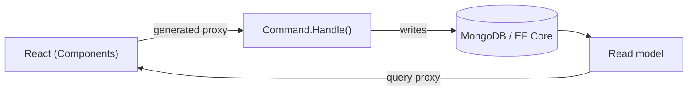

Building a modern full-stack application means making the same decisions over and over: how do commands get validated, how do queries get shaped, how does the React frontend learn the exact types the backend expects, and how do you keep all of it in sync as the code changes. Most teams answer these with a stack of libraries and a layer of hand-written glue — controllers, DTOs, fetch wrappers, validation duplicated on both sides.

Arc answers them once, with conventions, so you can spend your time on behavior instead of plumbing.

For Cratis, event sourcing is usually the default persistence architecture for information systems, and Chronicle is where that lives. Arc's job is different: it gives you the CQRS boundary for information going into and out of the system, then generates the frontend contract from that boundary. CQRS and event sourcing fit together naturally, but one does not require the other.

## What Arc gives you

- **Commands and queries as the unit of work.** A command is a record with a `Handle()` method — no separate handler class, no controller boilerplate. A query is a method on a read model. Arc maps them to HTTP automatically.
- **Generated TypeScript proxies.** Every command and query becomes a typed client your React code calls. Change a command's shape in C# and the frontend types change with it — the compiler catches the mismatch, not your users.
- **Pluggable persistence.** Commands and queries read and write wherever you point them — [Chronicle](/arc/backend/chronicle/) for event-sourced information systems, or [MongoDB](/arc/backend/mongodb/) and [EF Core / SQL](/arc/backend/entity-framework/) for current-state slices.
- **The cross-cutting concerns handled for you.** Validation, authorization, identity, multi-tenancy, OpenAPI, and MongoDB/EF Core integration are conventions, not assignments.

## Why CQRS and proxy generation

The two ideas reinforce each other. CQRS separates the thing you *do* (a command) from the thing you *see* (a query/read model), which keeps each side simple and independently optimizable. Proxy generation then makes that separation safe across the network: because the client is generated from the same C# types, there is no second source of truth to drift.

CQRS is often associated with event sourcing because events are a natural write-side model and projections are a natural read-side model. But CQRS is not event sourcing. Arc can put that boundary over Chronicle, MongoDB, or EF Core; Chronicle can store and process events without Arc.

That diagram is the direct-database setup, useful for bounded current-state slices and for learning Arc in isolation. In the full Cratis loop, the [Chronicle integration](/arc/backend/chronicle/add-event-sourcing/) changes the write side to events without moving the query or React screen.

## Vertical slices, not layers

Arc doesn't impose a folder structure, but it's built to make one shine: organize the application by **feature**, with a folder per slice inside it — the shape [event modeling](/event-modeling/) gives you. Everything for one behavior — the command, the read model and query it serves, the React component that renders it, and the specs that prove it — then lives in one folder, and you read a feature top to bottom instead of hunting across `Commands/`, `Handlers/`, `DTOs`, and `Clients/`.

## Where to start

- Build your first feature in the [getting started](/arc/backend/getting-started/) guide.
- Walk the full database-backed path in the [Arc tutorial](/arc/tutorial/).
- Need the wider stack? [Why developers choose Cratis](/why-cratis/) shows how Arc, Chronicle, Components, and the tools fit together.
