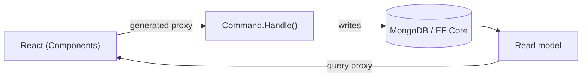

Building a modern full-stack application means making the same decisions over and over: how do commands get validated, how do queries get shaped, how does the React frontend learn the exact types the backend expects, and how do you keep all of it in sync as the code changes. Most teams answer these with a stack of libraries and a layer of hand-written glue — controllers, DTOs, fetch wrappers, validation duplicated on both sides.

Arc answers them once, with conventions, so you can spend your time on behavior instead of plumbing.

## What Arc gives you

- **Commands and queries as the unit of work.** A command is a record with a `Handle()` method — no separate handler class, no controller boilerplate. A query is a method on a read model. Arc maps them to HTTP automatically.
- **Generated TypeScript proxies.** Every command and query becomes a typed client your React code calls. Change a command's shape in C# and the frontend types change with it — the compiler catches the mismatch, not your users.
- **Pluggable persistence.** Commands and queries read and write wherever you point them — [MongoDB](/arc/backend/mongodb/) or [EF Core / SQL](/arc/backend/entity-framework/) for current state, with [Chronicle integration](/arc/backend/chronicle/) available when a slice needs event-sourced history.
- **The cross-cutting concerns handled for you.** Validation, authorization, identity, multi-tenancy, OpenAPI, and MongoDB/EF Core integration are conventions, not assignments.

## Why CQRS and proxy generation

The two ideas reinforce each other. CQRS separates the thing you *do* (a command) from the thing you *see* (a query/read model), which keeps each side simple and independently optimizable. Proxy generation then makes that separation safe across the network: because the client is generated from the same C# types, there is no second source of truth to drift.

That diagram is the default setup: Arc over a database, with command and query types generated into the frontend. When a feature needs history, auditability, replay, or reactors, the [Chronicle integration](/arc/backend/chronicle/add-event-sourcing/) changes the write side without moving the query or React screen.

## Vertical slices, not layers

Arc applications are organized by **feature**, not by technical role. Everything for one behavior — the command, the read model and query it serves, the React component that renders it, and the specs that prove it — lives in one folder. You read a feature top to bottom instead of hunting across `Commands/`, `Handlers/`, `DTOs`, and `Clients/`.

## Where to start

- Build your first feature in the [getting started](/arc/backend/getting-started/) guide.
- Walk the full database-backed path in the [Arc tutorial](/arc/tutorial/).
- Need the wider stack? [Why developers choose Cratis](/why-cratis/) shows how Arc, Chronicle, Components, and the tools fit together.
