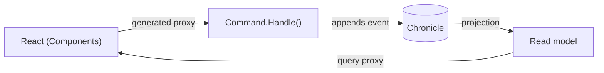

Building a modern full-stack application means making the same decisions over and over: how do commands get validated, how do queries get shaped, how does the React frontend learn the exact types the backend expects, and how do you keep all of it in sync as the code changes. Most teams answer these with a stack of libraries and a layer of hand-written glue — controllers, DTOs, fetch wrappers, validation duplicated on both sides.

Arc answers them once, with conventions, so you can spend your time on behavior instead of plumbing.

## What Arc gives you

- **Commands and queries as the unit of work.** A command is a record with a `Handle()` method — no separate handler class, no controller boilerplate. A query is a method on a read model. Arc maps them to HTTP automatically.
- **Generated TypeScript proxies.** Every command and query becomes a typed client your React code calls. Change a command's shape in C# and the frontend types change with it — the compiler catches the mismatch, not your users.
- **Pluggable persistence.** Commands and queries read and write wherever you point them — [MongoDB](/arc/backend/mongodb/), [EF Core / SQL](/arc/backend/entity-framework/), or [Chronicle](/chronicle/). Chronicle is the most powerful option — commands append [events](/chronicle/concepts/event/) and queries read [projections](/chronicle/concepts/projection/) out of the box — but [Arc works just as well without it](/arc/arc-without-event-sourcing/).
- **The cross-cutting concerns handled for you.** Validation, authorization, identity, multi-tenancy, OpenAPI, and MongoDB/EF Core integration are conventions, not assignments.

## Why CQRS and proxy generation

The two ideas reinforce each other. CQRS separates the thing you *do* (a command) from the thing you *see* (a query/read model), which keeps each side simple and independently optimizable. Proxy generation then makes that separation safe across the network: because the client is generated from the same C# types, there is no second source of truth to drift.

That diagram shows the most common setup — Arc over Chronicle. But the event store is a *choice*: the same command and query model runs over a plain database when you don't need history. See [Arc without event sourcing](/arc/arc-without-event-sourcing/).

## Vertical slices, not layers

Arc applications are organized by **feature**, not by technical role. Everything for one behavior — the command, the events it produces, the projection that builds its read model, the React component that renders it, and the specs that prove it — lives in one folder. You read a feature top to bottom instead of hunting across `Commands/`, `Handlers/`, and `Events/`.

## Where to start

- Build your first feature in the [getting started](/arc/backend/getting-started/) guide.
- Not using event sourcing? [Arc without event sourcing](/arc/arc-without-event-sourcing/) shows the standalone shape over MongoDB or EF Core.
- New to the underlying model? Read [Why Event Sourcing](/chronicle/why-event-sourcing/) and [Why Cratis](/why-cratis/) first.
